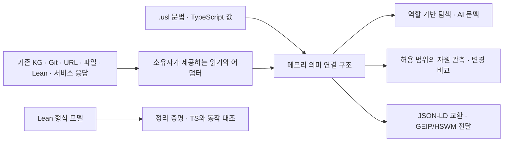

# USL — Universal Semantic Link

**USL은 서로 다른 시스템의 자원을 의미와 역할로 연결하는 문법과 TypeScript + Effect 라이브러리다.** KG·Git·URL·파일·Lean 4를 연결하며, 원본 데이터·고유 ID·권한은 각 시스템에 둔다. 별도 USL DB나 새 KG를 만들지 않는다.

2026-09-14 사용자 결정: **DB가 아닌 문법/연결 계층**, **Lean 선언·증명 연동과 USL 성질의 형식 검증 둘 다**, **가능한 다양한 자원으로 확장**. 사용자 원문과 구현 선택은 [결정 기록](docs/DECISIONS.md)에서 구분한다. 초기 KG 정의는 `sym:Concept:usl`이며 이 저장소의 최신 사용자 지시를 반영한 현재 기준은 이 README와 아래 문서다. 이 변경이 원격 KG의 옛 설명을 자동 갱신하지는 않는다.

- [현재 구조와 표준의 적용 범위](docs/ARCHITECTURE.md)
- [범용 자원 연결 문법·SDK·CLI·MCP](docs/RESOURCE_GRAPH.md)
- [Lean 4 연결과 형식 검증](docs/LEAN4_INTEGRATION.md)
- [사용자 매뉴얼](docs/USER_MANUAL.md) · [빠른 시작](docs/GETTING_STARTED.md) · [CLI](docs/CLI.md) · [MCP](docs/MCP.md)
- [기존 `.usl` 문법](docs/LANGUAGE.md) · [TypeScript 코드 내장](docs/CODE_INTEGRATION.md)
- [과거 설계·검증 기록](archive/README.md)

## 연결을 표현하는 방법

한 연결은 **의미 + 이름 있는 참여 역할 + 실제 자원 참조**다. 예를 들어 같은 기능의 요구사항, 코드, Lean 정리, 테스트 실행을 하나의 다자 연결에 넣을 수 있다. 관계를 반대로 탐색해도 원래 역할과 의미는 유지한다.

입력은 선택한다. 기존 KG 응답에는 `adaptPropertyGraph`, 다양한 시스템의 응답에는 `adaptResourceGraph`, Lean 선언에는 `adaptLean4Export`를 쓴다. 직접 작성할 때는 `.usl`의 `resource / meaning / link`나 TypeScript 값을 사용한다. 입력은 메모리의 `SemanticPlan`으로 해석되고, 호출 후 따로 저장할 필요가 없다.



`resource-graph/v1`의 `types`는 열린 IRI 목록이다. 코드 심볼, 증명, 데이터셋, 모델, 도구, 실행·프로세스, 문서의 일부, 사람·에이전트, 측정값 등을 표현할 수 있다. 읽기 수단은 현재 `kg / git_repo / url / filesystem`이며 새로운 서비스의 조회는 호스트의 `read` 콜백으로 연결한다. 도메인 타입을 추가했다고 해당 서비스의 실행 API가 자동 구현되는 것은 아니다.

## 실행

Node.js 22 이상과 `npm ci`가 필요하다. 기본 USL 사용에는 Lean이나 Python이 필요하지 않다.

```sh
npm ci
npm run example:adapter
npm run usl -- adapt --format resource-graph --graph examples/fixtures/resource-graph.json --namespace demo --operation context --focus example:spec --target example:sensor --compact
npm run mcp -- --config examples/usl.config.json
```

설정 예제의 `game`은 기존 property graph, `resources`는 14종 자원 연결 문법이다. 이 예제의 외부 주소는 가상 fixture이고 기본 읽기 허용 목록은 비어 있다.

Lean 4 연동은 저장소의 `lean/lean-toolchain`을 사용한다.

```sh
lake --dir lean build
npm run example:lean
npm run test:lean
```

Lean의 `#usl_export [...]`는 선언 이름·종류·명제·의존 공리를 내보낸다. SDK가 성공한 Lean 실행의 출력만 읽고 원본 `.lean` 파일 digest를 연결한다. KG나 코드가 그 정리의 의도와 정확히 대응하는지는 별도의 주장이다.

## 표준과 검증

JSON-LD 1.1/RDF 교환, PROV-O 출처 관계와 SHACL 구조 검사를 지원한다. `urn:usl:vocab:` 어휘와 GEIP는 프로젝트 고유 규약이다. [표준별 적용표](docs/ARCHITECTURE.md#표준-적용)를 참고한다.

```sh
npm run typecheck
npm test
npm run build
npm run test:lean
```

독립 RDF/SHACL 검사에는 Python 환경에서 `pip install -r scripts/requirements-standards.txt` 후 `npm run test:standards`를 실행한다.

Lean의 형식 모델은 역할 기반 연결, 경로 합성·역방향 탐색, 연결 선택의 보존성, 읽기 범위 축소를 증명한다. 실행 가능한 모델의 100개 경로를 TypeScript 구현과 대조한다. 전체 TypeScript 프로그램이나 외부 관계의 참을 증명한 것은 아니다. [검증 범위](docs/LEAN4_INTEGRATION.md#형식-검증-범위).

## 호환성과 과거 기록

기존 `.usl`, TypeScript API, property-graph/v2, CLI·MCP는 유지한다. 2026-09-14부터 자원 설명을 위한 단항 역할도 지원한다. 기존 plan의 형태와 기존 다자 선언의 digest는 바꾸지 않는다.

`pierce / audit / rebind`와 JSON 링크 레코드는 [레거시 파일 워크플로](docs/LEGACY.md)다. `program-store`는 프로세스의 파일 캐시다. 둘 다 DB가 아니다. 이전 설계 문서 23개는 [원문 아카이브](archive/2026-09-14-before-consolidation/manifest.json)에 해시와 함께 보존했다. `audit/`와 `observations/`의 날짜별 영수증은 당시 실행의 기록이며 현재 소스의 재검증 결과로 읽지 않는다.
