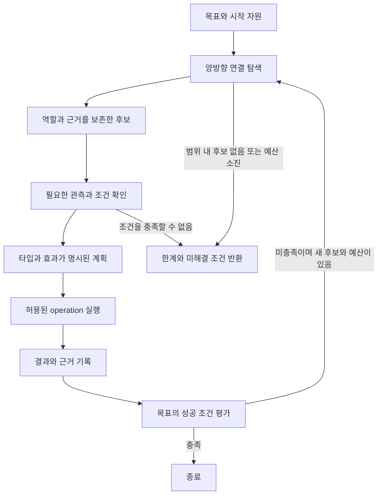

# USL 양방향 연결과 에이전트 실행 설계

2026-09-08 · Codex · T0 일반 공학 · 상세 계약은 SECONDARY_AI 설계

사용자 원문:

> ㅇㅇ 설계좀 보강해줘 그리고 양방향으로 연결성을 이해해서 agent 가 잘 동작하도록 할수 있게 해줘봐봐 ㅇㅇ

이 문서는 [시멘틱 어댑터 설계](SEMANTIC_ADAPTER_DESIGN.md)를 보강한다. [추가 연결 대상 조사](RESEARCH_CONNECTION_GAPS_2026-09-08.md)의 실행·시점·부분·주체를 반영하고, 양방향 탐색을 에이전트의 근거 있는 계획으로 연결하는 계약을 정의한다. 사용자 방향과 AI가 선택한 구체 구현을 구분한다.

## 1. 구현된 기반과 후속 설계의 경계

| 항목 | 현재 상태 |
|---|---|
| v0.1 `resource / meaning / link` 문법 | 유지. 다자 관계와 역할 타입을 이미 컴파일한다. |
| 어느 참여 자원에서든 연결을 찾는 탐색 | **구현:** 순수 TS `agentContext(plan, query)` 및 `usl context`. |
| 원래 링크·의미·전체 역할, 경로, 탐색 범위와 한계 | **구현:** 구조화 JSON으로 제공한다. |
| 의미의 명시적 역관계 view와 합성 규칙 | **후속 설계:** v0.1 parser/API가 아직 해석하지 않는다. |
| 목표 기반 operation 선택·관측 결합·계획·실행·보상 | **후속 설계:** 현재 context는 `NOT_OBSERVED / NOT_PLANNED`다. |

현재 실행 가능한 예제는 [agent-navigation.usl](../examples/agent-navigation.usl)이다. 이 파일의 자원과 관계는 설명용 선언이다. 아래 설계가 에이전트의 일반적 성공률이나 전체 인터넷 탐색을 이미 검증했다는 뜻은 아니다.

## 2. 양방향의 세 가지 의미

| 구분 | 예 | 요구 계약 |
|---|---|---|
| **양방향 탐색** | 저장소에서 checkout을 찾고, checkout에서 저장소를 찾음 | 원래 link의 역할별 incidence를 조회한다. 원래 의미와 참여자를 보존한다. |
| **의미의 역관계 view** | `checkout_of(local, repository)`를 `has_checkout(repository, checkout)`로 읽음 | 의미 모듈이 두 표현의 대응과 전체 역할 매핑을 명시한다. |
| **실행의 되돌림·보상** | 특정 실행이 만든 변경을 그 실행 receipt에 따라 보상함 | 별도 operation, 지원 범위, 실행 전제와 결과 계약이 필요하다. |

세 기능 사이에 자동 변환은 없다. `implements(repository, concept)`를 concept 쪽에서 탐색해도 `implements(concept, repository)`라는 새 주장을 만들지 않는다. checkout 관계를 거꾸로 읽었다고 디렉터리 삭제나 Git rollback 동작이 생기지도 않는다.

OWL 2의 inverse object property는 명시된 이항 관계의 역방향 의미를 다루는 선례다. USL의 다자 역할 view나 동작 취소 전체를 OWL이 제공한다는 뜻은 아니다. [OWL 2 inverse properties](https://www.w3.org/TR/owl2-syntax/#Inverse_Object_Properties). 관계를 별도 개체로 기술하는 선례는 [W3C N-ary Relations Working Group Note](https://www.w3.org/TR/swbp-n-aryRelations/)에서도 볼 수 있다.

## 3. 연결의 중심은 역할을 가진 주장

후속 공통 모델은 다음을 식별 가능하게 둔다. 이는 객체 계약이며 모든 항목을 새 예약어로 만들자는 제안이 아니다.

| 객체 | 핵심 내용 |
|---|---|
| ResourceRef | 내부 참조, 자원 kind/version, 외부 식별 근거, host/cluster/document/session 등 범위 |
| Snapshot / Selection | native revision·digest·관측 시각, 특정 표현에 결합된 부분 선택 |
| Meaning | 의미 ID/version, 설명, 역할 타입·개수, 명시된 view·합성 규칙 |
| Claim | 독립 주장 ID, meaning 참조, 전체 역할 배치, 원문/생성 출처, 적용 범위 |
| Observation / Assessment | 입력 snapshot, 검사 규칙/version, 관측 결과·시각, 평가의 범위 |
| Activity / Attempt | 실행 ID, 정의/version, 입력·출력, 수행 주체, 시작·종료·결과 |
| Operation | driver/version, typed 입력/출력, 요구 기능, 효과, 전제·산출 계약 |

주장은 다자 관계 전체로 유지한다. 예를 들어 `implements(repository, revision, concept, specification)`에서 concept만으로 검색해도 나머지 세 역할이 함께 반환되어야 한다. 원래 관계를 임의의 독립 이항 사실 네 개로 바꾸면 revision과 specification의 조건을 잃는다.

현재 v0.1 역할은 각자 자원 하나를 받는다. 후속 모델에서 역할별 복수 자원을 허용하려면 cardinality와 순서 의미를 추가로 명시한다. 동일 자원이 여러 역할을 맡는 것은 허용하되, 같은 locator의 서로 다른 선언을 자동 병합하지 않는다.

현재 context 안의 이름은 `namespace + name` 범위다. `planDigest`는 입력 SemanticPlan의 JSON 표현을 SHA-256으로 식별한다. 같은 이름의 선언이 개정되면 이전 context와 섞지 않도록 이 digest를 함께 사용한다. 이것은 외부 자원 내용, 정규화된 의미 동치, 영구 assertion ID를 증명하는 hash가 아니다. 후속 claim 저장에서는 원문 revision과 별도의 주장·관측 ID를 보존한다.

## 4. 양방향 탐색의 계약 — 구현됨

탐색 구조는 `resource → link instance → resource`다. 어느 역할을 진입점으로 삼아도 같은 link를 읽는다. 역할 이름이 `from/to`인지 또는 선언에서 몇 번째인지로 의미 방향을 추정하지 않는다.

```text
concept
  └─ implementation [concept → repository]
       └─ repository
            └─ working_copy [repository → local]
                 └─ checkout
```

이 경로의 `implementation`은 원래 `{repository, concept, specification}` 세 역할을 그대로 가진다. agent는 specification도 읽을 수 있다. query가 concept→repository 경로만 허용했다면 specification은 **관계 맥락**으로 포함되며, 그 query에서 도달한 결과로 표시하지 않는다.

구현 규칙:

1. BFS로 자원별 최단 hop 경로의 대표 하나를 반환한다. 모든 경로·독립 근거의 열거는 아니다.
2. 입력 plan의 링크 순서, 의미의 역할 순서로 동률을 결정한다. 최단 경로라는 사실이 가장 신뢰할 근거라는 뜻은 아니다.
3. 방문한 자원을 다시 확장하지 않아 순환을 끝낸다. 경로 이력에 의존하는 추론 규칙은 현재 지원하지 않는다.
4. 링크를 채택할 때 모든 참여자를 함께 포함한다. 자원 예산이 부족하면 링크 전체를 보류하고 한계에 기록한다.
5. 역할 필터는 정확한 `(meaning, enter, exit)`로 지정한다. 역방향도 허용하려면 해당 역할 경로를 추가하거나 필터를 생략한다.
6. context-only 자원은 `distance: null`이다. 목표를 찾았다는 판정은 실제 허용 경로가 있을 때만 나온다.
7. 출력은 원 plan/query와 객체를 공유하지 않는 복사본이다. 소비자가 주석을 붙여도 원본이나 다음 조회가 바뀌지 않는다.

반환 형태의 핵심:

| 필드 | 의미 |
|---|---|
| `namespace`, `planDigest` | 어느 입력 계획의 선언을 보고 있는가 |
| `resources`, `meanings`, `links` | locator·의미 설명·타입·전체 참여 역할 |
| `paths[].steps` | 원 link/meaning, from/to 자원, enteredRole/exitedRole |
| `target.status` | FOUND / NOT_FOUND_IN_SCOPE / NOT_FOUND_WITHIN_LIMITS |
| `coverage` | 입력 plan과 route 범위, 예산·소진 원인·조회 횟수 |
| `interpretation` | DECLARED, NOT_EVALUATED, NOT_OBSERVED, NOT_PLANNED |

`FOUND`는 선언 그래프 안의 구조적 도달이다. 외부 자원이 실제 존재하거나 권한 있는 동작을 할 수 있다는 뜻이 아니다. `NOT_FOUND_IN_SCOPE`는 제공한 plan과 route 내의 부재다. 외부 KG나 다른 파일까지 검색했다는 뜻이 아니다. 탐색이 잘렸으면 `NOT_FOUND_WITHIN_LIMITS`로 반환한다.

## 5. 명시적인 역관계 view — 후속 설계

역관계는 같은 주장을 다른 역할 배치와 의미 이름으로 읽는 view다. 다음은 **미구현 descriptor 예시**이며 v0.1 USL 문장이 아니다.

```json
{
  "sourceMeaning": "urn:example:checkout_of:v1",
  "viewMeaning": "urn:example:has_checkout:v1",
  "roles": {
    "local": "checkout",
    "repository": "repository"
  }
}
```

view 등록 시 모든 역할의 일대일 대응, 타입·cardinality 보존, 명시적 의미 버전 호환을 검사한다. 역할에 결합된 snapshot·선택자·scope도 같은 대응으로 이동한다. 다시 역으로 읽으면 원래 배치로 돌아와야 한다. 자연어 의미의 동등성 자체가 타입 검사만으로 증명되는 것은 아니며, 등록 주체가 선언한 동등성 계약과 근거를 별도로 보존한다.

반환 view는 `sourceClaimId`, `viewMeaning`, `roleMap`, 원래 evidence/assessment 참조를 가진다. 새 독립 주장·근거·승인을 자동 생성하지 않는다. 반대로 실제로 다른 조건·기간·판단을 주장하려면 새 Claim과 그 출처가 필요하다. inverse 선언이 없으면 구조 탐색은 가능하지만 inverse view는 `UNDECLARED`로 남긴다.

원 평가·승인은 source 참조로 표시하며 view 자체의 독립 승인 상태로 복사하지 않는다. 해당 view를 동작이나 정전 판단의 근거로 사용할 때는 기존 정책의 대상 의미/version·역할·scope가 이 사용을 포함하는지 확인한다. 동치 view까지 이미 허용한 정책은 그 범위에서 계속 적용하며, 매번 새 사용자 확인을 요구하지 않는다.

## 6. 합성·동기화·보상의 경계 — 후속 설계

`checkout_of(local, repo)`와 `implements(repo, concept, specification)`의 경로로 local과 concept을 찾을 수 있다. 이를 새 구현 주장으로 합성하려면 규칙 ID/version, 역할 대입, 타입·적용 범위, 입력 claim과 근거를 명시해야 한다. 예를 들어 local이 지정 commit의 작업 트리인지, 변경 파일이 있는지, specification과 검사 시점이 맞는지가 규칙에 포함될 수 있다.

규칙의 결과는 `derivedFrom: [원 주장들]`을 가진 새 주장 후보다. 동일 근거를 역방향 view나 요약에서 다시 만났다고 독립 증거로 세지 않는다. 명시적인 의미 규칙 없이 `related_to`, `closeMatch`, `implements` 등을 임의로 추이적으로 확장하지 않는다.

양방향 동기화가 필요한 adapter는 별도 계약을 가진다. source/target revision, 변화 집합, 충돌 정책, 보존할 정보와 손실, 동시 수정 검사를 명시해야 한다. 그래프의 역관계만으로 이러한 계약이 생기지는 않는다.

실행 보상도 별도 operation이다. 원 실행 receipt와 그 실행이 만든 자원/변경 범위, 현재 revision 전제, 수행 주체의 권한, 보상 가능 기간을 확인한다. 보상은 외부 효과를 완전히 없애는 수학적 역함수와 다를 수 있으므로 `compensated`, `partially_compensated`, `not_compensatable`, `failed`를 구분한다. 읽기·검사 operation에는 임의의 undo를 만들어 붙이지 않는다.

## 7. 에이전트의 목표·계획 계약 — 후속 설계

에이전트 요청은 자연어 목표와 함께 검사 가능한 성공 조건을 가져야 한다. 최초 연결 지점은 KG 개념, 파일, 실행 결과, 메시지 등 어느 자원이든 될 수 있다. 필요한 자원을 찾은 뒤 그 자원을 새 시작점으로 삼되 전체 탐색·실행 예산을 공유한다.

| 요청 항목 | 계약 |
|---|---|
| goal | 선언된 자원 찾기 / 관계 검사 / 실제 동작 수행을 구분하고 성공 조건을 지정 |
| anchors | 출처·범위가 있는 시작 자원들 |
| constraints | 필요한 의미·역할·종류·버전·시점·근거 수준 |
| executionContext | host가 제공하는 actor/effectivePrincipal와 기존 권한 범위 |
| budget | hop·자원·링크·조회·후보·실행 단계·재시도·시간의 상한 |

자연어와 의미 설명은 후보를 제안하는 데 사용한다. 실제 역할 대입·호출은 정확한 schema와 명시적 의미 매핑을 통과해야 한다. `resource` 내용이나 도구 설명문을 실행 권한·호출 명령으로 자동 해석하지 않는다.

후보는 다음 정보로 비교한다.

```text
Candidate
  operationRef/version?       어떤 driver 기능을 사용할 것인가
  bindings                    어떤 자원을 어느 입력 역할에 놓는가
  rationalePaths              원 link와 역할을 보존한 발견 경로
  preconditions               타입, revision, 시점, 근거, 실제 권한 조건
  effects                     none / external_read / external_write / ...
  missing                     아직 충족되지 않은 조건과 필요한 관측
  status                      discovered / needs_observation / ready / blocked
```

`operationRef`가 없으면 자원 발견 결과까지 반환한다. 관계 이름을 함수 이름으로 바꾸어 실행하지 않는다. 후보가 여러 개라면 명시적 역할/타입 일치와 적용 범위·근거 조건을 먼저 확인하고, 통과한 후보들 사이에서 비용·단계 수를 비교한다. shortest path, LLM 점수, 근거 개수만으로 의미의 참이나 권한을 높이지 않는다.

실행 단계의 최소 결과 계약:

```text
PlanStep
  id, operationRef/version, typed bindings
  derivedFrom paths/claims, expected outputs/evidence
  revision/freshness/authorization preconditions, effect, failure policy

StepResult
  stepId, attemptId, status, observedAt
  resolved inputs/snapshots, outputs, evidence refs, diagnostics
  assessment scope, provenance, remaining budget
```

계획과 실행 사이에서 대상이 바뀔 수 있다. 실제 호출 직전에 필요한 identity/revision/scope를 재확인하고, 불일치면 해당 실행을 멈추거나 허용된 관측·재계획으로 돌아간다. 기존 세션의 명시적 권한은 계속 사용한다. 매 단계의 사용자 확인을 기본 절차로 추가하지 않으며, 실제로 필요한 권한이나 입력이 없을 때만 그 부족을 보고한다.

## 8. 에이전트의 제한된 실행 루프 — 후속 설계



성공 조건은 작업 종류에 맞춘다. ‘선언상 연결된 저장소 찾기’는 구조적 탐색으로 충족할 수 있다. ‘그 저장소에 현재 접근하기’에는 접근 관측이 필요하고, ‘개념을 정확히 구현하는지 확인하기’에는 관계별 검사와 근거가 필요하다. 파일을 수정하는 목표에는 실제 수행 결과가 필요하다.

최소 종료 조건은 목표 충족, 탐색/실행/시간 예산 소진, 범위 내 새 후보 없음, 필요한 capability·권한·정보 부재, 해결되지 않는 상충·stale 상태다. 재시도와 재계획도 예산을 소비한다. 읽기 실패를 무제한 반복하거나 역방향 경로를 계속 돌며 근거를 늘리지 않는다.

에이전트 상태 전이는 순수 함수로 검사하고, 실제 resolve/read/watch/invoke는 Effect 서비스로 실행하는 방향을 유지한다. `StepResult`는 원래 주장과 별도인 관측·평가를 만든다. 기존 KG의 확정 상태나 다른 주체의 승인을 자동 변경하지 않는다.

## 9. 탐색·관측·권위의 결합 규칙 — 후속 설계

- 관측을 context에 자동 결합할 때 namespace만 비교하지 않는다. 해당 입력 계획의 digest로 생성 출처를 구분하고, 원 자원 locator/선택 범위·해석한 snapshot·driver/검사 규칙 버전·관측 시각을 확인한다. `planDigest`는 출처 혼합을 막는 키이며 증거의 적용 가능성을 단독 판정하는 키는 아니다.
- 같은 이름의 새 plan이나 바뀐 HEAD에 과거 관측을 자동 이식하지 않는다. 관측 v2는 `planDigest`와 `readScope`를 제공하고 context도 같은 digest 함수를 사용한다. 이를 검증하여 context에 결합하는 전용 API는 후속 설계이며, 임의 JSON 병합을 그 API로 취급하지 않는다.
- 다른 plan에서 얻은 불변 snapshot의 관측이나 plan 밖에서 생성된 증거도 명시적으로 참조할 수 있다. 이때 source plan/observer를 보존하고 readScope·snapshot/selector·검사 규칙·시점의 호환성을 검사한다. 의미 계약이 달라지면 같은 자원 관측을 재사용할 수 있어도 기존 의미 평가까지 재사용할 수 있는 것은 아니다.
- refuted, stale, unknown, unsupported를 삭제하거나 성공으로 치환하지 않는다. 적용 가능한 관측을 더 얻을 수 있으면 제한된 관측 단계로 돌아간다.
- 단순 URL/KG/파일 조회 성공은 의미 관계의 참을 평가하지 않는다. 구조 검증·관계 검사·서명 확인·실제 인가는 각각 무엇을 확인했는지 표시한다.
- 승인·근거·반례·수정 관계도 식별 가능한 주장으로 다룬다. 원문과 AI 해석, 독립 관측과 그 요약의 계보를 보존한다.

## 10. 현재 API와 CLI 사용

실제 동작하는 TypeScript API는 root export에서도 사용할 수 있다.

```ts
import { Either } from "effect"
import { compileSource, agentContext } from "./src/index.js"

const discoverCheckout = (source: string) => compileSource(source).pipe(
  Either.flatMap((plan) => agentContext(plan, {
    focus: "concept",
    target: "checkout",
    routes: [
      { meaning: "implements", enter: "concept", exit: "repository" },
      { meaning: "checkout_of", enter: "repository", exit: "local" },
    ],
    maxHops: 2,
  })),
)
```

입력은 `compileSource` 또는 `compileProgram`이 검증한 `SemanticPlan`이어야 한다. `JSON.parse` 결과를 type assertion만으로 plan으로 취급하는 것은 지원하지 않는다. context는 선언 탐색이며 외부 해석 서비스를 요구하지 않는다. CLI는 source 파일을 읽고 선택적으로 결과 파일을 쓰지만 자원 endpoint에는 접속하지 않는다.

```bash
# concept → repository → checkout. 원래 역할과 전체 다자 관계를 유지한다.
npm run usl -- context --source examples/agent-navigation.usl \
  --focus concept --target checkout

# 반대 시작점에서도 같은 link들을 사용한다.
npm run usl -- context --source examples/agent-navigation.usl \
  --focus checkout --target concept

# 에이전트가 사용할 역할 경로만 명시한다. --via는 반복할 수 있다.
npm run usl -- context --source examples/agent-navigation.usl \
  --focus concept --target checkout \
  --via implements:concept:repository \
  --via checkout_of:repository:local
```

| 한도 | 기본값 | 허용 범위 |
|---|---:|---:|
| `maxHops` / `--max-hops` | 2 | 0–32 |
| `maxResources` / `--max-resources` | 64 | 1–1000 |
| `maxLinks` / `--max-links` | 128 | 1–2000 |
| `maxVisits` / `--max-visits` | 1024 | 1–20000 |

`maxResources`에는 관계 맥락으로 함께 포함되는 자원도 센다. `maxVisits`는 검사한 `(자원, incident link)` 횟수이며 필터나 깊이 경계에서 검사한 것도 포함한다. 각 한도는 반환 그래프와 탐색을 제한한다. 전체 입력 plan의 파싱·검증·incidence index 작성과 digest 계산은 입력 크기에 비례하는 별도 비용이며, 이 API는 입력 파일 byte 크기나 wall-clock 실행 시간을 제한하지 않는다.

필터가 없으면 모든 역할 경로를 탐색한다. API의 `routes: []`는 아무 경로도 허용하지 않는다. `maxHops: 0`은 시작 자원만 반환하며 그 자원이 target이면 빈 경로로 FOUND다. 해석하지 못한 이름·역할·한도는 오류이며 필터를 조용히 제거하지 않는다. CLI의 정상 질의는 target 미발견이나 부분 결과라도 exit 0이고 JSON의 target/coverage를 확인한다. 잘못된 질의는 exit 64다. `--out`은 source와 다른 파일이어야 한다.

## 11. 검증 기준과 다음 구현 단위

현재 실행 검증은 양쪽 시작점의 원 link 보존, n-ary 역할 유지, alias/self-link/순환, 역할 경로 필터, context-only 대상의 오탐 방지, 최단 대표 경로, 모든 예산과 미발견 상태, plan/query의 불변성, source 파일 보존을 다룬다. 테스트는 [navigation.test.ts](../test/navigation.test.ts)와 [cli.test.ts](../test/cli.test.ts)에 있다.

후속 설계를 구현할 때 추가할 기준은 다음과 같다.

1. inverse view의 전체 역할 대응과 두 번 역변환 시 원상 복구. 원 claim/evidence의 복제 증가 없음.
2. snapshot·시점·범위를 묶은 observation 결합. 다른 plan이나 개정된 locator에 과거 결과를 붙이면 거부.
3. capability registry와 typed operation candidate. 원래 relation만으로 operation을 생성하지 않음.
4. 목표별 성공 조건과 제한된 Effect 실행 루프. 실패·상충·미지원과 실제 진행을 구분.
5. 명시적 합성 규칙과 필요할 때의 보상 계약. 현재 탐색 경로의 의미·권위를 자동 승격하지 않음.

이 순서는 다음 개발 단위의 제안이다. 이번에 구현한 범위는 **양방향 연결 탐색과 에이전트에 제공할 선언 context**이며, 자동 실행기·의미 inverse 문법·양방향 동기화까지 구현했다고 표시하지 않는다.
