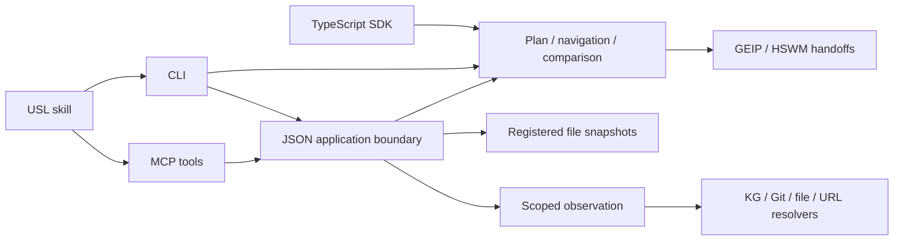

# USL application interfaces and automatic refresh

The primary integration path is now `connectUsl({ read, adapt, policy })`:
existing system → transient interpretation → context/observation/HSWM handoff.
It has no USL storage or file-registration step. Hosts expose these sources to
MCP via `policy.getConnection`; clients use `connection` and native UIDs.
See [ADAPTER_INTEGRATION.md](ADAPTER_INTEGRATION.md). The registered `.usl` file
workflow below remains an optional frontend.

For a local stdio deployment, `usl mcp --config usl.config.json` supplies the
same host-owned boundary without writing a custom server. Its startup config
maps fixed program IDs to `.usl` files and fixed connection IDs to existing
property-graph JSON files; all paths are relative to that config. A request can
select an ID and native UIDs, but cannot select a path or expand the global
read policy. Program files refresh valid edits through their registry; a graph
file is bounded-read and adapted for each selected request. Changing the
startup config itself requires a server restart. See [MCP.md](MCP.md).

The TypeScript API, CLI and MCP expose the same semantic plan, observation,
comparison and integration functions. `executeUslOperation` supplies the JSON
boundary for MCP and the new offline CLI operations; the existing CLI source
commands call the language functions directly.



Graph declarations, observation effects, version identity, and execution
authority remain separate. A reverse traversal retains the original link and
all participant roles. A declared check is not an executed check. A GraphSpec
import preserves its source and component identities without claiming runtime
conformance; see [the GEIP integration](GRAPH_ENGINEERING_INTEGRATION.md).
GEIP is the project's local draft profile, not an industry certification.

## A registered source has a stable ID

```ts
import { openProgramRegistry } from "usl/program-store"
import { executeUslOperation, DEFAULT_USL_POLICY } from "usl/application"

const programs = await openProgramRegistry({ game: "/srv/usl/game.usl" })
try {
  const policy = { ...DEFAULT_USL_POLICY, getProgram: programs.getProgram }
  const context = await executeUslOperation("context", {
    program: "game", query: { focus: "spec" }, compact: true,
  }, policy)
  console.log(context)
} finally {
  programs.close()
}
```

The host chooses the files at startup. A request selects an ID. Requests cannot
register paths or change the server's resource allowlist. Files persist on disk;
this registry is a process-local cache, not a database or persistent registration
service. SDK `getProgram` callbacks are trusted host code and must return a
validated source/plan pair. Tool inputs are plain JSON data: inherited options,
accessors and values that serialization would discard are rejected.

The registry watches each parent directory and checks file metadata before a
request. It rereads a changed file within a byte limit, compares source digests,
and compiles only when that source differs from the last valid source. A valid
result atomically replaces the immutable source/plan snapshot. An invalid edit
sets `INVALID_EDIT`: new registry requests fail while already-held snapshots
remain usable. The low-level `snapshot()` deliberately returns that last valid
snapshot; use `getProgram()` for fresh reads that reject invalid edits.

An observation in progress retains the version it started with. Closing the
registry releases watchers. Source directories are host-controlled; this is not
a sandbox against an OS user who can replace configured files.

## Cost and limits

No separate manual `compile` command is needed before `context`, `observe`, or
registered MCP requests. `compile` exports a plan when explicitly wanted.
Direct CLI invocations compile their selected source for that invocation.

Unchanged registered files reuse their compiled plan. Only a changed registered
file is recompiled, but compilation is still whole-file; there is no incremental
compiler within a file. Cloning, validation, hashing and output serialization
can still scale with plan size. Observation also checks source/plan consistency.
These caches do not make arbitrary large graphs constant-cost.

This swaps connection declarations for subsequent requests. It does not replace
running JavaScript functions, migrate game state, rewrite consumer code, or
synchronize DBs. `semantic.bind(fn, link)` preserves the original function;
consumers must explicitly obtain a refreshed plan if they want updated links.

Tests cover unchanged cache reuse, changing one registered file independently,
invalid edits, in-flight observation identity, strict JSON inputs, denied reads,
and a real stdio MCP client. Token savings against Cypher have not been measured;
see [the comparison and evaluation criteria](USL_AND_CYPHER.md).
