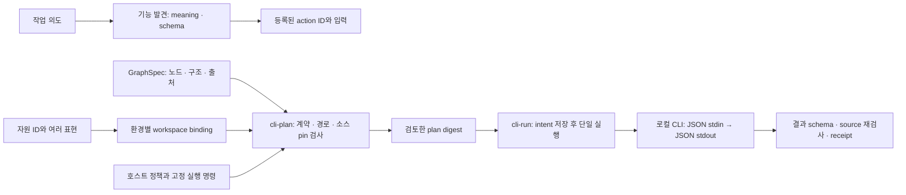

# 경로·의미 그래프·CLI 실행의 통합 설계

2026-09-28 사용자 요청에 따른 구현과 설계다. 세부 schema와 실행 범위는 구현 선택이다. USL의 문법·연결 계층이라는 방향을 유지하며 별도 DB를 요구하지 않는다.

## 현재 구현한 흐름



새 [CLI host](../src/cli-host.ts)는 등록된 GraphSpec의 `code` 또는 `tool` 진입 노드 하나를 호스트의 고정 명령에 연결한다. 선택 노드로 들어오는 간선이 있으면 거부한다. 선행 데이터·승인·분기 등을 실행했다고 추정하지 않기 위해서다. `scope: ENTRY_NODE_ONLY`, `wholeGraphExecution: NOT_EXECUTED`, `geipValidation: NOT_RUN`을 기록한다.

이 범위는 GraphSpec 전체 실행기의 첫 구성 요소다. GEIP의 lifecycle·gate·retry·outbox·checkpoint를 지원하는 엔진이 있다는 뜻은 아니다. 그런 그래프의 자동 실행은 아래 확장 조건을 충족해야 한다.

## 경로를 정리하는 기준

주소, 자원의 정체성, 특정 시점의 내용을 구분한다. 예를 들어 `urn:project:USL`은 저장소를 가리키는 소유자 ID다. `/work/USL`, `/home/me/USL-feature`, GitHub 저장소 URL은 그 저장소를 다루는 서로 다른 작업공간·표현이다. 이 이름들은 호스트가 명시적으로 연결한다.

| 요소 | 예 | 바뀌는 조건 |
|---|---|---|
| 자원 ID | `urn:project:USL:validator` | 소유자가 다른 자원으로 판정할 때 |
| 표현 ID | `validator-worktree`, `validator-commit` | 별도 checkout·mirror·snapshot을 추가할 때 |
| 표현의 역할 | `working-copy`, `snapshot`, `documentation`, `mirror` | 그 표현을 사용하는 목적이 바뀔 때 |
| workspace binding | `project → /work/USL` | 머신·디렉터리·컨테이너가 바뀔 때 |
| 상대 경로 | `src/validation.ts` | 저장소 안에서 파일을 이동할 때 |
| revision / content pin | full Git commit, SHA-256 | 기준 내용이 바뀔 때 |
| 실행 계획 digest | 설정·경로·입력·소스·명령의 결속 | 실행에 영향을 주는 결속이 바뀔 때 |

[resource bindings](RESOURCE_BINDINGS.md)는 자원별 복수 표현을 담는다. 절대 경로는 호스트 설정의 `workspaces`에만 둔다. 폴더 전체를 옮기면 workspace mapping을 바꾸고, 저장소 내부 파일을 옮기면 해당 표현의 상대 경로를 바꾼다. 자원 ID와 의미 링크는 유지하고 새 binding으로 관측·실행 계획을 만든다. 과거 관측이나 실행 영수증의 경로는 당시 사실이므로 바꾸지 않는다.

여러 worktree는 각기 다른 workspace/representation으로 등록한다. 로컬 파일과 GitHub `blob/main/...`은 서로 다른 내용을 보여줄 수 있다. 원격 소스 근거는 가능한 full commit의 Git locator나 [GitHub permalink](https://docs.github.com/en/repositories/working-with-files/using-files/getting-permanent-links-to-files)를 사용한다. [Git worktree](https://git-scm.com/docs/git-worktree)는 여러 작업 트리를 지원하므로 같은 repository라는 이유만으로 checkout 상태까지 같다고 취급하지 않는다.

표현이 둘 이상인데 선택을 생략하면 오류다. 로컬 실패 뒤 원격으로 자동 전환하지 않는다. 자동 fallback은 content/revision 동등성 확인, 별도 읽기 권한, 대체된 표현의 기록을 갖춘 뒤 추가해야 한다. 현재 Git 표현은 정확히 40 또는 64자리 commit을 요구한다. URL에 `snapshot` 역할을 붙이는 것만으로 그 URL의 불변성이 증명되지는 않는다.

파일 내용의 동일성도 자원 동일성과 다르다. 우연히 바이트가 같은 두 파일을 하나의 자원으로 합치지 않는다. PROV-O의 [alternateOf/specializationOf](https://www.w3.org/TR/prov-o/)처럼 표현·특정화의 관계를 명시할 수 있지만, USL은 이름이나 경로 유사성만으로 그 관계를 만들어내지 않는다.

현재 workspace 해석은 root와 대상의 realpath 포함 관계를 확인한다. `..`와 root 바깥의 symlink를 거부한다. 기존 locator 문법이 표현하지 못하는 공백·일부 특수문자 경로는 명시적으로 실패한다. 범용 파일 URI escaping은 기존 locator/digest 호환성을 고려한 별도 변경이 필요하다.

## 기존 의미 그래프에 적용

`bind-graph`는 기존 `resource-graph/v1`의 선택한 resource ID에 새 locator를 적용한다. ID·meaning·역할·metadata를 보존하고 이전 graph, bindings, 새 graph와 선택 결과의 digest를 영수증에 남긴다. 따라서 주소 이동이 의미 링크를 새로 만드는 원인이 되지 않는다. 선택하지 않은 자원의 locator는 유지한다.

```sh
usl bind-graph --config host.json --graph graph.json \
  --selections selections.json --out rebound-envelope.json
```

`selections.json`은 `[{"resource":"urn:project:USL:validator","representation":"validator-worktree"}]` 같은 목록이다. 결과의 `graph`를 SDK `adaptResourceGraph` 또는 기존 `adapt` CLI에 전달한다. 관측 읽기 권한은 여전히 별도로 지정한다. binding이 locator를 만들었다고 접근 권한이 생기지는 않는다.

## skills와 MCP의 역할을 어떻게 옮길 것인가

공식 문서에서 [skills](https://developers.openai.com/codex/skills)는 지침·참고 자료·스크립트를 묶고 필요한 때 본문을 읽는 형식이다. [MCP](https://developers.openai.com/codex/mcp)는 도구와 문맥에 접근하는 연결 프로토콜이다. 두 역할을 그래프와 CLI에 옮길 때도 발견·지침·권한·실행의 책임을 각각 구현해야 한다.

| 현재 역할 | USL에서 맡을 구성 요소 | 이 구현의 상태 |
|---|---|---|
| 언제 어떤 기능을 쓸지 찾기 | meaning·입출력 schema·capability catalog | 기존 발견 API 및 `cli-list` |
| 작업 절차와 제약 읽기 | 버전이 고정된 instruction 자원 + 의미 링크 | 기존 자원/문맥 모델로 연결 가능, 자연어 지침 자동 컴파일 없음 |
| 경로와 참조 찾기 | 자원 ID → 명시적 표현 → workspace binding | `locate`, `bind-graph` |
| 입력·권한 검사 | owner policy·descriptor/source pin·schema | `cli-plan`, 실행 직전 재검사 |
| 로컬 프로그램 호출 | 고정 executable/argv/cwd + JSON stdin | `cli-run`, 한 번의 시도 |
| 상태·근거 남기기 | intent/result 파일 + 계획·결과 digest | 구현, 자동 재시도 없음 |
| 원격 세션·인증·구독 | MCP/HTTP 등의 transport adapter | 기존 MCP 경로 유지; 새 범용 원격 driver 미구현 |
| 다단계 workflow 실행 | GraphSpec를 집행하는 외부 runtime | 미구현; 들어오는 의존 간선은 거부 |

로컬 셸 도구가 있는 에이전트는 USL CLI를 직접 호출해 기능별 MCP 서버 의존성을 줄일 수 있다. host가 CLI 실행 경로를 제공하지 않는 환경에서는 remote tool/connector 같은 접근 수단이 필요하다. 그래프 파일만 추가해도 모든 에이전트가 이를 자동 발견한다는 보장은 없다. 시작 지침에는 `usl cli-list`와 문맥 조회 방법만 짧게 두고, 작업별 지침·경로·정책을 그래프/호스트 계약에 모으는 방식이 적합하다.

기존 skill이나 MCP 설정을 삭제하는 것은 이 구현에 필요하지 않다. 먼저 동일한 작업의 CLI 결과와 계약을 확인한 뒤 호출부를 옮긴다. 새 실행 기능은 기존 read-only MCP tools에 노출하지 않았다.

## host 등록과 실행 계약

전체 예제는 `npm run example:cli`다. 임시 설정을 만들고 실제 USL `check` CLI를 자식 프로세스로 실행한다. [예제 코드](../examples/cli-workflow.ts)는 기존 `.usl` 파일과 runtime source를 pin하며, 완료 후 임시 파일을 정리한다.

`npm run example:cli -- --out-dir /tmp/my-usl-host`를 쓰면 새 디렉터리에 실제 `host.json`, `bindings.json`, `invocation.json`, `plan.json`, 실행 영수증을 남긴다. 기존 디렉터리는 덮어쓰지 않는다. 출력된 설정과 요청으로 위 CLI를 직접 호출할 수 있으며, 재실행에는 새 receipt directory가 필요하다.

예제의 [GraphSpec](../examples/fixtures/cli/graphspec.json)은 기존 GEIP 전체 제안 형식에서 파생했다. 실제 SYMPOSIUM validator v0.2.0에서 GEIP-001∼015의 문서 구조 검사를 통과한 [영수증](../examples/fixtures/cli/graphspec-validation.json)을 보존한다. lifecycle·effect·checkpoint 필드의 구조 적합성과 CLI host가 그 정책 전체를 집행한다는 주장은 다르다. 실행 시 validator를 다시 호출하지 않으므로 runtime receipt는 계속 `geipValidation: NOT_RUN`이다.

호스트 JSON은 [cli-host.schema.json](../schemas/cli-host.schema.json)을 따른다. 주요 항목은 다음과 같다.

- `bindings`, `workspaces`: portable 문서와 환경별 root mapping. 상대 경로는 host 설정 파일 기준이다.
- `actions[].descriptor/policy`: 기존 capability 계약. 등록 시 descriptor/source pin과 owner 결속을 검사한다.
- `actions[].graph`: 원문 digest, GraphSpec digest, graph ID, 선택 entry node, 명시적 실행 범위.
- `command`: 현재 Node 실행 파일 또는 호스트의 절대 executable, 고정 인수, 허용한 환경 변수 이름. 인수에 자원 선택을 쓰면 해당 파일 pin을 요구한다.
- `cwd`: 명시적으로 선택한 workspace 디렉터리. `pins`: 실행에 영향을 주는 호스트 선택 파일들의 정확한 내용.
- `maxSourceBytes`: pin 검사를 위해 읽는 파일들의 합산 한도. capability policy의 timeout과 출력 한도는 실제 프로세스에도 적용한다.

실행 파일은 별도로 최대 256 MiB까지 스트리밍 SHA-256을 계산해 계획에 결속한다. 크기와 수정시각만 같은 다른 실행 파일로 바뀌어도 이전 계획으로 실행할 수 없다.

```sh
usl cli-list --config host.json
usl locate --config host.json --resource validator --representation validator-worktree
usl cli-plan --config host.json --action validate --input invocation.json --out plan.json
usl cli-run --config host.json --action validate --input invocation.json \
  --expected-plan 'sha256:<plan.json의 planDigest>' --receipt-dir ./new-attempt
```

`invocation.json`은 기존 `descriptorDigest`, `sourceDigest`, `input.types`, `input.value`, 선택적 `input.unit` 계약이다. 요청 데이터는 JSON stdin으로만 전달한다. 호출자가 command, argv, cwd, 환경 변수, policy를 주입하는 필드는 없다. `cli-list`에서 정책은 반환하지 않는다.

run은 현재 계획과 `--expected-plan`이 맞아야 한다. 새 디렉터리에 `intent.json`을 먼저 쓰고 파일을 동기화한 뒤 프로세스를 시작한다. 이미 존재하는 receipt directory는 재사용하지 않는다. 실행 뒤 출력 schema와 pin을 다시 검사하고 `result.json`을 기록한다.

| 결과 | 의미 |
|---|---|
| `REJECTED` | 사전 조건·계획이 맞지 않아 실행하지 않음 |
| `SUCCEEDED` | 해당 시도의 exit 0, 정상 UTF-8/JSON, 출력 schema, 재검사한 pin 일치 |
| `INDETERMINATE` | 실행 후 오류·timeout·취소·초과 출력·잘못된 출력·source 변경. 효과가 발생했을 수 있음 |

stdout과 stderr를 합산해 제한한다. timeout/취소 때 POSIX에서는 프로세스 그룹을 종료한다. 프로세스가 별도 세션으로 탈출하거나 원격 작업을 시작하면 취소를 보장하지 못한다. 등록된 프로그램을 실행하는 호스트 경계이며 OS sandbox가 아니다.

`intent.json`만 남으면 프로세스 중단이나 결과 저장 실패가 가능하다. 이를 실패 확정으로 간주해 재실행하지 않고 소유자 쪽 효과를 확인한다. digest는 변경 검출용이며 서명·사용자 승인·HSWM Permit이 아니다.

실행 전 취소나 spawn 실패처럼 자식 프로세스가 시작하지 않았으면 `REJECTED`, `attempts: 0`이다. 실행 후 result 저장 실패는 `RECEIPT_WRITE_FAILED`, `receiptPersisted: false`의 불명 결과를 반환한다. 결과에는 저장한 intent의 digest를 연결해 조사할 시도를 식별한다.

source pin은 열거한 파일만 검사한다. 의존 파일, lockfile, 빌드 산출물과 도구 버전도 실행에 영향을 주면 등록해야 한다. 실행 전후 검사는 바꾸었다 되돌리는 경쟁 상태를 증명하지 못한다. 더 강한 재현성이 필요하면 고정 commit의 깨끗한 worktree 또는 immutable container에서 실행하고 그 환경 identity를 함께 기록해야 한다.

## 다음 확장 순서와 완료 조건

1. **원본 identity 확인:** Git remote 정규화, worktree/commit/dirty 상태, GitHub repository ID를 호스트 adapter에서 확인한다. 이름·URL만 보고 fork나 mirror를 합치지 않는다. 지금의 binding은 명시적 등록이며 원격 GitHub 사실의 검증기가 아니다.
2. **실제 task 하나의 완주:** 기존 검증 CLI처럼 입출력이 명확한 프로그램부터 등록한다. discovery → 선택 → context → plan → run → receipt가 이어져야 한다. 오류·이동·pin drift·권한 거부에서도 같은 계약을 유지한다.
3. **다단계 GraphSpec 집행:** 데이터 간선의 schema, gate의 독립 인가, FSM 전이, loop budget, 중복 효과 식별, checkpoint 호환성, unknown effect의 reconciliation을 집행한다. 그 전까지 entry node 단독 실행을 전체 workflow 성공으로 승격하지 않는다.
4. **원격 driver와 실행 근거:** 필요한 실제 시스템부터 SCIP/OpenLineage/MCP/OpenAPI adapter를 추가한다. 등록된 기능 목록과 실제 호출 transport를 분리하고, 명세에 등장한 주소를 자동 호출하지 않는다.
5. **thin skill/MCP facade:** 같은 application/host 계약을 쓰는 얇은 호출부로 전환한다. 호출부마다 별도 경로·정책·workflow 설명이 누적되지 않게 한다.

전체 로드맵을 한 번에 구현했다고 표시하지 않는다. 현재 완료 범위는 기존 읽기 한도 보완, 자동 CI, 이동 가능한 자원 결속, resource graph rebinding, 그리고 GraphSpec entry node에 근거를 둔 실제 CLI 실행 경로다.
