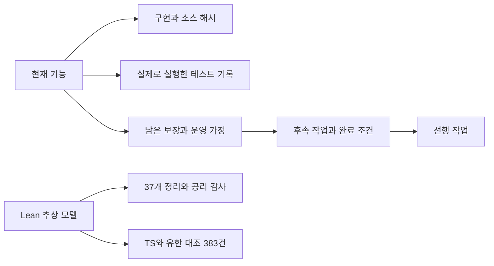

# USL 현재 상태와 다음 작업 — 2026-09-28

검토 대상 구현은 `01239ca94abab374cca0a7240c4fb31235fb221a`다. 이번 문서는 기능을 늘리는 작업에 앞서 구현·증거·미증명 영역·후속 작업을 연결한다. 작성자의 설계 판단은 `SECONDARY_AI`이며 사용자 비준이나 실행 권한을 뜻하지 않는다.

## 현재 내용을 그래프로 읽기



- [현재 상태 resource graph](../research/engineering/current-state.graph.json): 기능·구현·검사·Lean 모델·후속 작업의 명시적 관계.
- [JSON-LD / PROV 표현](../research/engineering/current-state.graph.jsonld), [역할 profile](../research/engineering/current-state.profile.json): 기존 USL adapter와 RDF 도구로 탐색한다.
- [기존 40기술 검토 그래프](../research/engineering/graph.json): 외부 기술 조사와 공통 제어 12개, 반례 검사 25개의 범위다. 새 CLI 소스를 pin하지만 25개 반례가 CLI 전용 테스트를 대신하지 않는다.
- [Lean 범위 감사](../audit/LEAN_SCOPE_2026-09-28.md), [공식 자료 대조](../research/engineering/DIRECTION_REVIEW_2026-09-28.md): 서로 다른 검증 근거를 보존한다.

표준 적용은 **JSON-LD/RDF 교환, PROV 출처 연결, SHACL 구조 검사**다. 기능 상태와 작업 관계를 표현하는 `urn:usl:status:*`는 프로젝트 어휘다. GEIP v0alpha1도 로컬 GraphSpec draft 계약이다. JSON-LD 또는 GEIP 문서 검사를 통과했다고 국제 인증이나 workflow 실행 보장을 얻는 것은 아니다. SHACL은 입력 그래프와 제약의 적합성을 검사한다. [W3C SHACL](https://www.w3.org/TR/shacl/)

## 구현·테스트·증명 범위

| 영역 | 현재 구현 / 확인 | Lean4 증명 범위 | 남은 작업 |
|---|---|---|---|
| 의미 그래프·탐색·읽기 범위 | native ID, 역할, 제한된 탐색·관측 | 추상 모델 일부 37개 정리; TS 대조 383건 | TS 전체와 모델의 refinement 증명 |
| 경로·복수 표현 | stable ID, workspace 상대 경로, 명시적 선택, graph rebinding | 새 binding 모델은 미구현 | Git remote/worktree/commit/dirty 사실 확인, 선택·rebinding 모델 |
| 기능 발견·인가 | capability catalog, schema, scope/effect, source pin 검사 | 미증명 | owner·정책 revision 이력, 실제 driver 계약 |
| CLI 실행 | 고정 명령, 계획 digest, intent/result, 한 번의 시도, 취소·한도 | 미증명 | 중단 후 상태 조회·대조, 중복 요청 식별, 상태 기계 |
| GEIP | GraphSpec 보존·digest 검사, 독립 entry node 연결 | entry gate/lifecycle 미증명 | 다단계 실행, 데이터 간선·gate·budget 집행 |
| 검증 자동화 | 로컬 TS 282개, Lean 통합 4개 통과; CI 정의 존재 | CI 통과 자체는 형식 증명이 아님 | GitHub 원격 CI 실행 결과 확인 |

Lean 모델에 `sorry`를 남겨 두고 통과시킨 결과는 아니다. 현재 37개 정리의 전이 공리 의존성을 검사하며 허용 범위는 `propext`, `Classical.choice`, `Quot.sound`다. 그러나 **Lean 모델 정리의 증명과 TypeScript/OS 구현의 정확성은 별개의 주장**이다. 공식 Lean 문서도 증명 유효성과 명제의 의도된 의미를 구분한다. [Lean proof validation](https://lean-lang.org/doc/reference/latest/ValidatingProofs/)

## 다음 작업: 실행 상태·복구 계약부터

다음 구현 단위는 **단일 CLI 시도의 상태를 명세하고, 중단 뒤 같은 시도를 다시 실행하지 않고 조회·대조하는 기능**이다. 현재 `intent.json`만 남은 경우에는 실행 전 중단인지, 실제 효과 후 결과 저장 전 중단인지 파일 하나로 알 수 없다. 이 구분을 해결하기 전에 workflow 재시도를 확대하면 중복 효과를 만들 수 있다. 요청 식별자와 서버의 중복 처리 계약이 재시도 안전성의 근거라는 AWS 지침과 일치하는 판단이다. [AWS idempotent APIs](https://aws.amazon.com/builders-library/making-retries-safe-with-idempotent-APIs/)

| 작업 | 우선순위 / 선행 | 산출물과 완료 조건 |
|---|---|---|
| T1 실행 상태 계약과 Lean 모델 | P0, 먼저 | 이벤트/전이 정의; intent 저장 전 spawn 금지, pin 불일치 시 시작 0회, 미확정 결과의 자동 재시도 금지를 모델에서 증명. TS trace 대조는 별도 유한 검사로 표기 |
| T2 조회·복구와 중복 요청 처리 | P0, T1 후 | `inspect/reconcile` 경로; intent-only를 `UNKNOWN`으로 분류; 소유자 근거로 `APPLIED/NOT_APPLIED/UNKNOWN`을 기록. 같은 operation key+intent hash 중복 요청 방지, 충돌 거부, 저장 경계별 crash/restart 검사 |
| T3 경로 정체성 확인과 binding 모델 | P1, T1과 병렬 가능 | repo/worktree/commit/dirty 관측과 출처, URL/SSH 정규화. fork·mirror는 근거 없이 합치지 않음. 이동·dirty·다중 worktree 테스트와 표현 선택/ID 보존 Lean 모델 |
| T4 최소 다단계 GraphSpec 실행 | P1, T1·T2 후 | 우선 READ-only DAG 2~3노드; 간선 schema·의존성·실패 전파·step/time budget 집행. gate/loop는 구현 전 명시적 거부 |
| T5 실제 프로그램 하나 이관 | P2, T3·T4 후 | 발견→문맥→계획→실행→조회·복구를 하나의 실제 작업으로 완주. skills/MCP 호출부가 같은 host 계약을 사용하도록 연결 |
| T6 출처·신뢰 범위 강화 | P2, T2 후 | config/policy/binding 소유자와 revision 결속; 필요한 배포 경계에서 서명·검증 추가. 자체 receipt를 SLSA/in-toto 인증으로 승격하지 않음 |

T1의 제안 상태는 `PLANNED → INTENT_DURABLE → STARTED → SUCCEEDED | INDETERMINATE`와 시작 전 거부다. crash 뒤 intent만 있는 경우를 `STARTED`나 `NOT_STARTED`로 추정하지 않는다. T2의 중복 식별자는 재시도와 경로 이동에 걸쳐 유지하는 **logical operation key**와 요청 의미의 hash로 설계한다. 절대 경로가 포함된 plan digest만을 key로 쓰면 폴더 이동이 중복 방지를 깨뜨릴 수 있다. owner가 idempotency/status query를 제공하지 않는 경우 `UNKNOWN`을 유지한다.

각 상태 정리는 OS·파일시스템의 실제 내구성, 프로세스 종료, SHA-256 무충돌을 자동 증명하지 않는다. 어떤 외부 이벤트를 신뢰하는지 모델에 가정으로 남긴다. 실제 Node 실행 경로는 실패 주입 테스트와 trace 대조로 확인하고, 이후 필요한 범위의 refinement 증명으로 확장한다.

## 인터넷 대조의 결론

**현재 방향은 타당하다.** 자원 identity와 표현 분리, 호스트 권한, 제한된 실행, 결과 불확실성의 보존은 공개 명세와 일관된다. [PROV-O](https://www.w3.org/TR/prov-o/)는 entity·activity·agent와 출처를 기술하며, [SLSA v1.2](https://slsa.dev/spec/v1.2/build-requirements)는 산출물 digest와 생성 과정·provenance 신뢰성의 요구를 정의한다. 이 근거에서 USL의 로컬 해시·기록이 제공하는 범위를 구분하는 판단을 도출했다.

현재 구조를 발전시키려면 복구 계약·검증 범위를 먼저 채우고, 그 위에 작은 workflow와 실제 driver를 올리는 순서가 적합하다. skills의 지침 역할과 MCP의 원격 연결 역할은 USL 그래프·호스트 계약에 맞춰 얇게 연결한다. 그래프 파일을 만드는 것만으로 에이전트 발견·원격 인증·실행이 자동 활성화되는 것은 아니다.

## 재현과 갱신

```sh
npx tsx scripts/build-current-state.ts --check
npx tsx src/cli.ts adapt --format resource-graph \
  --graph research/engineering/current-state.graph.json \
  --profile research/engineering/current-state.profile.json \
  --namespace usl.status --operation context \
  --focus feature:cli --target task:T2 --compact
python3 scripts/validate-current-state.py
```

현재 상태 그래프는 이 검토의 snapshot이다. 그 안의 locator는 당시 환경의 주소이며 stable resource ID와 별개다. 다른 환경에서는 명시적 binding으로 주소를 다시 연결한다. 생성기는 구현·테스트·Lean 소스 및 package lock이 검토 commit과 같은지 확인하고, 문서·실행 기록의 digest를 결속한다. 실행 기록은 호스트 보고이며, 이 비교와 해시가 실제 실행을 암호학적으로 인증하지는 않는다. 후속 구현 후에는 새 실행 근거와 검토 기준을 마련해 갱신해야 한다. 과거 25개 반례 영수증이나 37개 정리의 범위를 자동으로 확대하지 않는다.
