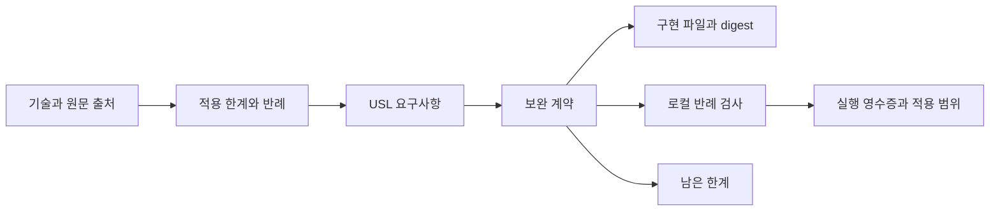

# 공학 보완 계약과 40항목 검증 그래프

2026-09-22 구현. 이전 [조사](RESEARCH_AI_NATIVE_ADAPTERS_2026-09-22.md)의 40항목을 **기술 → 적용 한계 → USL 요구사항 → 구현 → 로컬 반례 검사 → 실행 증거**로 연결했다. 사람이 읽는 결과는 [보완 매트릭스](ENGINEERING_ADVERSARIAL_MATRIX.md), 원본은 [catalog](../research/engineering/catalog.json)다.

이번 변경은 실제 USL 라이브러리·CLI·MCP 설정 경로에 보완 계약을 추가한다. 40개 제품을 모두 설치하거나 그 구현을 공격한 결과는 아니다. 공식 자료가 설명하는 범위, 그 범위를 넘겨 사용할 때의 반례, USL의 로컬 검사 결과를 구분한다. 모든 항목에 미구현 driver와 남는 한계가 있다. 표의 `LOCAL_CHECKS_PASS`는 연결된 공통 방어 기능이 로컬 테스트를 통과했다는 뜻이다.

## 그래프와 표준의 적용



| 형식 / 검사 | 실제 제공 | 의미 |
|---|---|---|
| [resource graph](../research/engineering/graph.json) | 40기술·한계·요구사항·반례·공통 제어·구현·원문·실행 증거 | 기존 USL adapter와 native ID 탐색으로 읽음 |
| [JSON-LD 1.1 / RDF](../research/engineering/graph.jsonld) | 역할 참여자와 선언 관계, PROV-O entity/activity/agent 참조 | 외부 RDF 도구에서 파싱 가능 |
| [SHACL](../schemas/engineering-review.shacl.ttl) | 의미별 필수 역할·자원 타입·허용 역할 검사 | 기존 resource graph shape와 함께 독립 pySHACL로 검사 |
| [DomainProfile](../research/engineering/profile.json) | 같은 도메인 역할 규칙을 USL 입력 경계에서 검사 | SDK·CLI·등록된 MCP connection에 적용 |
| [JSON Schema](../schemas/capability.schema.json) | versioned descriptor, profile, catalog, receipt의 구조 명세 | 중복 ID·참조·digest 등 교차 필드 조건은 TS 검증기가 추가 검사 |
| [실행 영수증](../research/engineering/receipt.json) | 로컬 테스트 결과와 코드·replay script·dependency lock 등의 pin | `HOST_REPORTED_LOCAL_TESTS`; 서명·외부 제품 인증은 아님 |

`urn:usl:engineering:`은 프로젝트 어휘다. JSON-LD/RDF·PROV-O·SHACL을 사용한다는 것과 이 어휘가 국제 표준이라는 것은 다르다. 기존 [GEIP GraphSpec](GRAPH_ENGINEERING_INTEGRATION.md)은 실행 흐름을 위한 별도 로컬 draft 투영으로 유지한다. 이번 산출물은 지식·근거 그래프이며 GEIP runtime 또는 D4 인증을 주장하지 않는다.

## 1. 역할 타입과 맥락 profile

`parseDomainProfile`, `checkResourceGraphProfile`와 `adaptResourceGraph(raw, { namespace, profile })`을 추가했다. `profile`을 생략한 기존 출력과 digest는 유지한다.

- `types`에 지정한 IRI가 모두 존재해야 한다. 자동 subclass·sameAs·closeMatch 추론은 하지 않는다.
- 필수 역할, 허용하지 않은 추가 역할, 닫힌 profile에서 모르는 meaning을 검사한다.
- 자원 metadata의 필요한 키·정확한 값을 검사한다. 예: `revision`, `unit`, metric의 시간창.
- 열린 profile에서는 검사하지 않은 링크를 `unprofiledLinks`로 반환한다.
- profile ID/version/digest를 적용된 plan의 의미 설명에 포함한다. 같은 원본이라도 profile 변경은 의미 계약 변경으로 추적된다.
- JSON-LD에 적용한 profile 참조를 남긴다. 모든 링크의 지위는 계속 `DECLARED`다.

```sh
npm run usl -- adapt --format resource-graph \
  --graph research/engineering/graph.json \
  --profile research/engineering/profile.json \
  --namespace usl.engineering.review --operation check

npm run usl -- adapt --format resource-graph \
  --graph research/engineering/graph.json \
  --profile research/engineering/profile.json \
  --namespace usl.engineering.review --operation context \
  --focus technology:S03 --target requirement:S03
```

MCP는 관리자 설정에 `profile` 파일을 등록한다. 경로는 설정 파일의 디렉터리에 상대적이다. 매 호출에서 그래프와 profile을 읽고 검사하며, 유효하지 않은 새 제약을 이전 결과로 대체하지 않는다. 클라이언트 tool argument로 profile 경로나 제약을 바꿀 수 없다. [설정 예제](../examples/usl.config.json)의 `engineering-review` connection을 사용할 수 있다.

```json
{
  "graph": "../research/engineering/graph.json",
  "profile": "../research/engineering/profile.json",
  "namespace": "usl.engineering.review",
  "format": "resource-graph"
}
```

## 2. 기능 발견과 호출 전 검사

`CapabilityDescriptor`는 connection·native operation·source digest·meaning·입출력 타입/schema·단위·effect·필요 scope·mapping 지원 범위를 기술한다.

`discoverCapabilities(descriptors, query, inventoryComplete)`는 공급한 목록 안에서 정확한 meaning IRI와 선택적 input type/connection으로 검색한다. `maxResults`, `maxInspected`를 반드시 지정한다. 부분 inventory나 제한 초과에서 못 찾은 경우 `UNKNOWN_WITHIN_LIMITS`를 반환한다. 검색 성공은 실행 인가가 아니다.

호스트가 관리하는 [capability catalog](CAPABILITY_CATALOG.md)를 등록하면 같은 발견·사전 검사 기능을 CLI와 MCP에서도 사용할 수 있다. 카탈로그는 설명자와 선택적 정책을 결속하고, 요청에는 등록 ID만 받는다.

`preflightCapability(descriptor, request, policy)`는 다음을 확인한다.

1. 소유자 connection/capability binding과 descriptor/source pin.
2. owner의 허용 effect와 scope. 미지 effect 및 미구현 `SUBSCRIBE`는 거부.
3. 의미 매핑의 존재, 완전성, 미지원 항목, owner가 수용한 정보 손실.
4. 입력 도메인 타입과 단위의 정확한 일치.
5. 입력 크기와 JSON Schema 적합성. 출력 schema의 지원 여부도 효과 전에 검사.

JSON Schema 검사는 [Ajv strict mode](https://ajv.js.org/strict-mode.html)를 사용한다. 현재 명시적으로 허용한 부분집합은 boolean schema, type/properties/required/additionalProperties, items/prefixItems, allOf/anyOf/oneOf/not, enum/const, 문자열 길이·수치·배열·객체 개수 제약과 title/description이다. `$schema`는 Ajv가 지원하는 2020-12 문서에 사용한다. `$ref`·`$dynamicRef`·pattern·format·사용자 keyword·원격 schema loading은 거부한다. 스키마 최대 64 KiB, 중첩 32, properties 128, 조합 분기 64라는 경계가 있다. 타입 강제변환·default 삽입·필드 삭제를 하지 않는다. 세부 dialect 제약도 [Ajv JSON Schema 문서](https://ajv.js.org/json-schema.html)를 따른다.

이 검사는 type·unit 등의 **선언 계약**을 비교한다. 입력에 붙은 의미 타입이 실제 세계에서 참인지, mapping report가 모든 손실을 정직하게 기록했는지는 별도 검증 대상이다.

## 3. 명세를 가져오는 경계

`importMcpTools(raw, options)`는 MCP `tools/list` 응답을 가져온다. `nextCursor`가 있으면 완전한 inventory로 표시하지 않는다. description·annotation은 원문에 보존하며 effect·인가·업무 meaning을 생성하는 데 쓰지 않는다. host의 `bindings`가 명시적으로 meaning·타입·effect·scope를 연결한다. 아직 binding이 없는 도구는 `UNKNOWN` effect와 비어 있는 meaning을 가진다.

`importOpenApi(raw, options)`는 OpenAPI **3.1.x JSON 문서의 제한된 operation 목록**을 가져온다. native operation ID는 `METHOD /path`, resource identity는 명시된 `operationId` 또는 그 대체값이다. JSON body/단일 success response schema를 받아들인다. parameters 직렬화·보안 scheme mapping·callbacks·여러 성공 응답·여러 media type·알 수 없는 document dialect는 미지원으로 표시하고 callable 계약으로 쓰지 않는다. path item `$ref`는 inventory 누락을 숨기지 않도록 import 자체를 거부한다. webhooks가 있으면 수입 범위를 부분으로 표시한다. 외부 주소를 읽거나 API를 호출하지 않는다.

`inventoryResourceGraph(inventory, sourceLocator)`는 정확한 원문과 source digest를 검사하고 기능 설명을 기존 resource graph로 연결한다. locator는 host가 공급한 실제 표현의 주소다. 기능에 붙인 의미·effect는 owner binding의 선언이며 upstream의 인가로 해석하지 않는다. 현재 importer는 MCP resource/prompt 전체나 OpenAPI의 완전한 HTTP driver가 아니다.

원문을 재해석해 native operation·schema·완전성이 보존됐는지도 검사한다. OpenAPI path template, 매핑되지 않은 응답 헤더와 후속 links는 `unsupported`로 남긴다.

## 4. Effect 실행 경계와 결과

`connectCapability({ descriptor, policy, execute })`는 host가 직접 넘긴 Effect callback만 실행한다. 등록 때 descriptor와 policy를 복사·고정하고, 호출 입력도 효과 전에 복사한다. descriptor의 문자열로 명령·코드·callback을 만들지 않는다. CLI와 MCP에는 임의 실행기를 설치하는 tool을 추가하지 않았다.

- `REJECTED`: 사전 검사 실패, executor 호출 0회.
- `SUCCEEDED`: callback이 완료됐고 출력의 JSON 구조·schema·payload byte budget을 만족.
- `INDETERMINATE`: 실행 이후 오류, timeout, 잘못된 출력. 효과가 발생했을 수 있으며 자동 재시도하지 않음.

호스트 executor는 `expectedSourceDigest`를 받는다. 실제 외부 최신 상태와의 원자적 비교·조건부 쓰기는 소유자가 구현해야 한다. timeout은 Effect의 협력적 중단이며 원격 효과의 취소 보장이 아니다. `maxOutputBytes`는 출력 payload에 적용되며 영수증 envelope는 별도다. 영속 재시도/재개·분산 transaction·exactly-once·reconciliation과 stream lifecycle은 아직 제공하지 않는다.

```sh
npm run example:capability
```

[예제 코드](../examples/capability-workflow.ts)는 로컬 MCP 설명 fixture를 가져와 기능을 발견하고, 허용된 callback 1회와 단위 불일치 요청의 사전 거부를 보여준다. 실제 원격 MCP 서버에 연결하는 예제는 아니다.

## 5. 검증 영수증과 재현

```sh
npm run engineering:build  # 반례 재실행 → pin·영수증·그래프·표준 출력·매트릭스 생성
npm run engineering:check  # 현재 파일 pin과 이미 생성한 artifact의 정확한 일치 검사
npm run engineering:standards  # rdflib + pySHACL의 독립 구조 검사
```

표준 검증용 Python 의존성은 [기존 requirements](../scripts/requirements-standards.txt)를 격리 환경에 설치할 수 있다. `engineering:standards`는 전체 RDF를 파싱하고, 기술 수 40과 구조 적합성을 검사한 뒤 역할 타입 제거·거짓 검증 상태·중복 역할을 주입해 거부되는지 확인한다.

catalog는 임의 `solved`나 `verified` 필드를 받지 않는다. control 상태는 실제 replay의 check ID, owner control, 결과와 source/catalog pin으로 계산한다. builder는 전이 의존성을 포함하도록 `src/`의 모든 TypeScript 파일을 pin한다. 결과 누락·잘못 연결한 check는 `UNVERIFIED`, 코드·lock·계약 변경은 `STALE`, 실패한 실행은 `LOCAL_CHECKS_FAILED`다. `LOCAL_CHECKS_PASS`에도 residual은 필수로 남는다. 개별 PASS 기록에도 현재 적용 상태를 같이 노출한다.

영수증의 `sourceRoot`는 실행 당시 checkout의 주소다. 다른 머신에서는 `engineering:build`로 새로운 로컬 영수증을 만들 수 있다. `engineering:check`는 과거 테스트를 다시 실행하지 않으며 cryptographic attestation을 수행하지도 않는다. 파일 digest가 같은 경우라도 host가 실행 기록을 거짓으로 만든 문제를 이 라이브러리가 해결하지는 않는다.

새 계약은 **TypeScript 실행·반례 테스트와 RDF/SHACL 구조 검사**로 검증한다. 기존 Lean 37개 모델 정리의 증명 범위에 새 기능의 전체 정확성을 포함하지 않는다. 각 외부 시스템의 driver·도메인 검증·분산 실행 보장은 [매트릭스](ENGINEERING_ADVERSARIAL_MATRIX.md)의 남은 범위에서 계속 추적한다.
