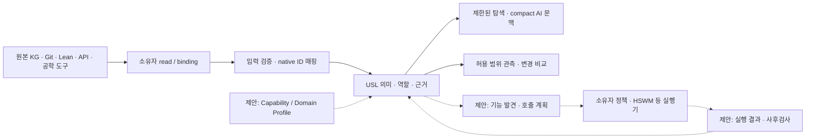

# USL의 AI native 범용 어댑터 발전 방향과 유사 기술 조사

조사일: **2026-09-22** · 구현 기준: `250b493` · 성격: 외부 자료 조사와 **AI 설계 제안**.

사용자 요청: “그 작업 이어서 해줘봐봐 USL 을 ai native 하고 공학적으로 모든걸 다 연결할수 있는 어댑터로 성장하려면 … usl 이랑 비슷한것도 잇다고 그러던데 검색해서 관련내용 싹다 찾아줘봐봐”.

공식 규격·프로젝트 문서·제작사 자료를 중심으로 **40개 비교 항목**을 조사했다. 항목 하나에 연관 규격을 묶기도 했으므로 제품 40개 또는 국제 표준 40개라는 뜻은 아니다. 기술의 설명과 USL에 대한 제안을 구분했다. 문서에 적힌 버전은 검토한 판본이며 모두 최신판이라는 주장은 아니다. 가변 문서와 `main` 브랜치의 내용은 조사 당시 기준이다. 검색으로 분야 전체의 완전성이나 USL의 독창성을 입증할 수는 없다.

이 문서는 [9월 7일 선행 조사](RESEARCH_SEMANTIC_ADAPTERS_2026-09-07.md), [9월 8일 연결 대상 조사](RESEARCH_CONNECTION_GAPS_2026-09-08.md)를 [현재 구현](ARCHITECTURE.md)에 대조해 확장한다. 구체 작업과 완료 조건은 [개발 로드맵](AI_NATIVE_ADAPTER_ROADMAP.md)에 있다. 이번 변경은 조사·로드맵 문서이며 아래 미구현 기능을 추가한 릴리스가 아니다.

## 1. 조사에서 얻은 판단

**USL의 발전 방향은 기존 시스템의 자원·기능·실행·근거를 같은 계약으로 연결하고, AI가 그 계약을 발견·검사·설명할 수 있게 하는 것이다.** 원본 데이터, 고유 ID, 실행 권한은 소유 시스템에 둔다는 기존 방향을 유지한다. 이것은 [기존 사용자 결정](DECISIONS.md)에 맞춘 설계 제안이다.

“비슷한 것”은 실제로 있다. 무엇이 비슷한지에 따라 가장 가까운 대상이 달라진다.

| 비교 관점 | 가장 가까운 선례 | USL에 주는 시사점 — AI 판단 |
|---|---|---|
| 요구사항·코드·시험 등 여러 공학 도구의 자원을 연결 | **OSLC**: 분산 자원의 Linked Data 연결과 발견·형태·접근 계약. [Core 3.0](https://docs.oasis-open-projects.org/oslc-op/core/v3.0/os/oslc-core.html) | USL의 공학적 위치를 설명할 때 가장 먼저 비교할 대상이다. |
| 자원이 제공하는 기능과 실제 접근 방법을 함께 기술 | **WoT Thing Description**: property/action/event, schema, forms, security metadata. [TD 1.1](https://www.w3.org/TR/wot-thing-description11/) | 어댑터 능력과 프로토콜 바인딩을 분리하는 설계에 가깝다. |
| AI가 외부 도구·자원에 접근 | **MCP**: 도구·자원·프롬프트와 클라이언트/서버 상호작용. [검토 규격](https://modelcontextprotocol.io/specification/2025-11-25) | 기존 USL MCP 노출을 유지하면서 외부 MCP 자원의 의미를 받아들이는 경로를 확장할 수 있다. |
| 업무 객체·관계·행동을 하나의 모델에 연결 | **Palantir Ontology**: object/link/action types와 interfaces. [타입 참조](https://www.palantir.com/docs/foundry/object-link-types/type-reference) | 의미와 실행을 연결하는 제품 선례다. USL의 라이브러리·문법 형태와 제품 범위는 다르다. |
| 의미 모델을 여러 형식에 투영 | **LinkML**: 스키마와 여러 표준·언어 대상 생성기. [생성기](https://linkml.io/linkml/generators/) | 공통 계약과 어댑터별 표현력 차이를 다루는 참고점이다. |
| 형식적인 변환과 수학 지식 연결 | **CQL**, **MMT**. [CQL](https://categoricaldata.net/CQL/), [MMT 언어](https://uniformal.github.io/doc/language/) | 변환 합성의 성질과 형식 체계 사이의 번역을 연구할 때 참고한다. |
| 이름이 비슷한 “Universal Semantic Layer” | **Cube·dbt Semantic Layer**: 지표·차원·분석 의미의 일관성. [Cube](https://cube.dev/blog/business-intelligence-with-universal-semantic-layer), [dbt](https://docs.getdbt.com/docs/use-dbt-semantic-layer/dbt-sl) | 분석 도메인의 의미 계층이다. USL과 연결 가능한 대상이지만 현재 USL 전체와 같은 범위는 아니다. |

따라서 “의미를 붙여 여러 시스템을 연결한다” 자체를 새로운 발명으로 주장할 근거는 없다. **소유자 자원을 그대로 사용하면서 이름 있는 다자 역할, 선언과 관측의 구분, 근거의 버전, AI 문맥 예산, Lean으로 검증한 일부 구조 계약을 함께 제공하는 조합**이 USL의 현재 특징이다. 이 조합의 유용성은 실제 작업 비교로 입증해야 한다.

## 2. 저장소에서 확인한 현재 위치

아래는 문서의 희망 사항이 아니라 기준 커밋의 코드와 검증 기록을 읽은 결과다. 과거 테스트 숫자는 당시 실행 기록이며 이번 조사에서 전체 테스트를 재실행했다는 뜻이 아니다.

| 영역 | 현재 확인한 구현 | 남아 있는 간격 |
|---|---|---|
| 입력과 어댑터 | `.usl`, TypeScript, property graph, resource graph, Lean export. `connectUsl`의 소유자 `read`와 순수 `adapt` 분리. [코드](../src/adapters.ts) | 공통 capability manifest, 기능 검색·협상 계약은 아직 없다. |
| 자원 타입 | 열린 `types` IRI, metadata와 provenance를 보존. [코드](../src/integrations/resource-graph.ts) | 도메인 타입은 설명에 보존된다. resource graph에서 생성하는 역할은 `kind: "any"`이므로 도메인 타입 적합성을 검사하는 것은 아니다. |
| 의미와 관계 | 이름 있는 다자 역할, `MeaningContract`, 중복·누락 검사. [모델](../src/language/model.ts) | 일반 도메인 타입·단위·버전 조건에 대한 의미 적합성 검사기는 없다. 선언된 check는 관측 시 `NOT_EXECUTED`다. [관측 코드](../src/language/runtime.ts) |
| 식별과 읽기 | native ID 매핑, KG·Git·URL·파일 locator, scope 제한. [resolver](../src/resolve.ts) | locator가 필수다. 읽을 수 있는 표현이 없는 개념·일시적 handle의 공통 참조 계약은 더 설계해야 한다. Git `::symbol`은 현재 명시적으로 거부한다. |
| AI 문맥 | 역할 경로, 탐색 범위·누락 상태, compact context, digest 기반 `UNCHANGED`. 직접 SDK에는 선택적 tokenizer 예산도 있다. [탐색](../src/language/navigation.ts), [compact](../src/language/compact.ts) | 의미별 능력 발견과 작업 성공률 평가는 없다. tokenizer 옵션이 모든 CLI/MCP 경로에 그대로 노출된 것은 아니다. |
| MCP | 9개 USL operation을 노출하는 stdio 서버, 고정 connection/program ID. [코드](../src/mcp.ts) | 임의 외부 MCP 서버의 전체 기능을 발견·수입하는 범용 MCP 어댑터는 없다. KG용 MCP 접근과 구분한다. |
| 변경과 근거 | 주소·내용·의미 계약 비교, source/plan/result digest 영수증. [비교](../src/language/comparison.ts), [어댑터](../src/adapters.ts) | 일반 이벤트 구독·증분 갱신·재시작 cursor 계약은 없다. digest는 서명이 아니다. |
| 외부 실행 | 호스트가 명시한 Lean 실행, HSWM 전달 인자 준비. [Lean](../src/integrations/lean4.ts), [HSWM](../src/integrations/hswm.ts) | 범용 외부 action의 계획·인가·실행·취소·재시도 계약은 없다. 그래프 탐색을 실행으로 해석해서는 안 된다. |
| 표준 교환 | JSON-LD/RDF 출력, PROV-O, SHACL 구조 검사. [현재 범위](ARCHITECTURE.md#표준-적용) | 임의 JSON-LD의 역수입, 일반 변환 손실 보고, 왕복 보존 계약은 아직 없다. |
| 형식 검증 | 37개 Lean 모델 정리, TS 대조 383건이라는 기존 기록. [실행 기록](../audit/LEAN_PROOFS_2026-09-14.md) | 전체 TS 구현의 refinement proof, 외부 관계의 참, 모든 어댑터의 의미 보존 증명은 아니다. |

현재 USL은 이미 **AI가 소비할 수 있는 제한된 의미 연결 계층**이다. 다음 진전은 자원 종류 이름을 더 늘리는 일보다, **자원이 어떤 기능을 제공하고 어떤 조건에서 연결 가능한지 기계가 검사할 수 있게 하는 일**에 있다.

## 3. 유사 기술과 연결 후보 40항목

각 표의 마지막 열은 USL 적용에 대한 AI 제안이다. 프로젝트·제품의 기능 설명은 링크한 1차 자료에 근거한다. 제품 설명을 독립 성능 검증이나 USL보다 우수하다는 판정으로 해석하지 않는다.

### A. 직접적인 설계·제품 비교

| ID | 기술 / 검토 자료 | 제공하는 것 | USL 적용과 경계 |
|---|---|---|---|
| S01 | [OSLC Core 3.0](https://docs.oasis-open-projects.org/oslc-op/core/v3.0/os/oslc-core.html) | 공학 도구 자원의 연합 연결, capability 발견, resource shape | 요구사항·변경·시험 도구와 연결할 우선 표준. JSON-LD 출력만으로 OSLC 준수가 되는 것은 아니다. |
| S02 | [WoT TD 1.1](https://www.w3.org/TR/wot-thing-description11/) | 상호작용 affordance, 데이터 스키마, 접근 forms와 보안 기술 | `Capability`와 실제 binding의 분리. descriptor에 적힌 기능과 현재 권한을 구분한다. |
| S03 | [MCP 2025-11-25](https://modelcontextprotocol.io/specification/2025-11-25), [tools](https://modelcontextprotocol.io/specification/2025-11-25/server/tools) | AI 앱이 도구·자원 등에 접근하는 프로토콜과 구조화된 도구 계약 | inbound inventory adapter 후보. 외부 tool annotation은 신뢰 근거가 없으면 권한·무해성의 증명이 아니다. |
| S04 | [A2A v0.3.0](https://a2a-protocol.org/v0.3.0/specification/) | Agent Card, skill, task, message, artifact를 통한 에이전트 상호운용 | 에이전트의 기능·작업·산출물을 자원으로 연결. A2A task 성공을 도메인 주장의 참으로 승격하지 않는다. |
| S05 | [LinkML](https://linkml.io/linkml/generators/), [slots](https://linkml.io/linkml/schemas/slots.html) | 의미 모델, slot 제약, JSON Schema·RDF·SHACL·언어별 생성기 | 도메인 profile을 생성·검사할 후보. 모든 생성 대상이 같은 표현력을 가진다고 가정하지 않는다. |
| S06 | [Palantir Ontology](https://www.palantir.com/docs/foundry/object-link-types/type-reference) | 업무 객체·관계·행동·인터페이스를 모델링 | 의미→행동 연결의 제품 비교 대상. USL의 저장소 독립 계약과 비교하되 전체 플랫폼을 재현할 필요는 없다. |
| S07 | [Composio](https://docs.composio.dev/), [인증](https://docs.composio.dev/docs/authentication) | 도구 발견, 사용자 연결·인증, 앱의 action 실행 | 이미 있는 SaaS 연결을 소유자 binding으로 활용할 후보. 커넥터 수 자체가 의미 호환성을 뜻하지 않는다. |
| S08 | [Airbyte Agents](https://docs.airbyte.com/ai-agents/), [기존 커넥터 모델](https://github.com/airbytehq/airbyte/blob/master/docs/platform/move-data/sources-destinations-connectors.md) | 데이터 복제뿐 아니라 에이전트의 API 연결·검색·행동을 위한 별도 기능군 | ETL만 하는 것으로 분류하면 현재 비교가 불완전하다. USL은 원본/결과/실행과 계약을 연결할 수 있다. |

### B. 의미 모델·매핑·형식적 연결

| ID | 기술 / 검토 자료 | 제공하는 것 | USL 적용과 경계 |
|---|---|---|---|
| S09 | [RDF 1.1](https://www.w3.org/TR/rdf11-concepts/), [JSON-LD 1.1](https://www.w3.org/TR/json-ld11/) | IRI 기반 그래프 모델과 JSON 교환 표현 | 현재 교환 기반을 유지한다. 저장 방식·실행 권한·외부 세계의 진실성은 별도 계약이다. |
| S10 | [SHACL](https://www.w3.org/TR/shacl/) | RDF 그래프의 shape 제약 검사 | 역할별 타입·필드·개수 검사를 도메인 profile로 확장. 물리 법칙이나 코드 정합성의 증명으로 확대하지 않는다. |
| S11 | [PROV-O](https://www.w3.org/TR/prov-o/) | entity/activity/agent와 생성·사용·파생 관계 | 어댑터 버전, input snapshot, 실행, output·claim의 계보. 출처 기록과 출처 인증은 다르다. |
| S12 | [SKOS](https://www.w3.org/TR/skos-reference/), [SSSOM](https://github.com/mapping-commons/sssom/) | 개념 매핑 관계와 매핑 근거·메타데이터 교환 | 같은 뜻·유사한 뜻·더 넓은 뜻을 분리. n-ary 연결을 이항 매핑으로 내보내면 생기는 손실을 표시한다. |
| S13 | [RML](https://rml.io/specs/rml/) | 여러 구조·직렬화의 데이터를 RDF로 매핑하는 규칙 | JSON/CSV/XML/DB 표현을 받는 mapping profile 후보. RML을 W3C Recommendation으로 오기하지 않는다. |
| S14 | [Ontop](https://ontop-vkg.org/guide/) | 원본 관계형 DB에 데이터를 둔 가상 KG, SPARQL→SQL 변환 | DB를 복제하지 않는 의미 조회의 직접 선례. USL 코어에 SQL 질의 엔진을 넣는 대신 결과 어댑터로 연결할 수 있다. |
| S15 | [CQL](https://categoricaldata.net/CQL/), [연구 목록](https://categoricaldata.net/papers) | functorial data migration과 관련 구성의 구현·연구 | 제한된 매핑의 합성·제약 보존을 연구할 근거. 일반 서비스 실행이나 모든 의미 동치를 해결하는 것은 아니다. |
| S16 | [MMT](https://uniformal.github.io/doc/), [언어·theory morphism](https://uniformal.github.io/doc/language/) | 논리·기초 체계에 독립적인 형식 지식 모듈과 번역 구조 | Lean 정리 참조를 넘어 형식 체계 사이의 연결을 연구할 후보. Lean 정리의 다른 증명기로의 자동 이전을 보장하지 않는다. |

### C. API·이벤트·실행과 어댑터 구현

| ID | 기술 / 검토 자료 | 제공하는 것 | USL 적용과 경계 |
|---|---|---|---|
| S17 | [OpenAPI 3.1.1](https://spec.openapis.org/oas/v3.1.1.html) | HTTP API의 operation, parameter, request/response schema | API inventory를 자동으로 가져올 좋은 입력. endpoint 이름만으로 효과·권한·업무 의미를 추론하지 않는다. |
| S18 | [AsyncAPI 3.0.0](https://www.asyncapi.com/docs/reference/specification/v3.0.0) | channel/message/operation과 protocol binding | 스트림·이벤트 기능 descriptor. 전달 순서나 broker의 실제 신뢰성은 실행 계약에서 확인한다. |
| S19 | [CloudEvents](https://github.com/cloudevents/spec/blob/main/cloudevents/spec.md) | source·id·type 등을 포함한 공통 이벤트 envelope | 원본 변경 알림과 관측 갱신을 연결. 이벤트가 전달됐다는 사실을 정확히 한 번 실행됐다는 보장으로 해석하지 않는다. |
| S20 | [Apache Camel](https://camel.apache.org/manual/faq/what-is-camel.html) | EIP 기반 routing·mediation과 component 연결 | 전송·재시도·라우팅 기반을 재사용할 후보. 의미 모델의 역할과 실제 메시지 흐름의 역할을 구분한다. |
| S21 | [n8n integrations](https://docs.n8n.io/integrations/) | node를 통한 외부 서비스 연동 | 기존 workflow 정의·실행·결과를 USL 자원으로 연결. 범용 의미 계약은 별도 profile이 필요하다. |
| S22 | [Apollo Federation](https://www.apollographql.com/docs/graphos/schema-design/federated-schemas/federation) | 여러 GraphQL subgraph의 schema 합성과 연합 조회 | 도메인 소유권·키·합성 오류 처리의 선례. GraphQL 타입 합성이 업무 의미의 동치를 뜻하지 않는다. |
| S23 | [WebAssembly Component Model / WIT](https://component-model.bytecodealliance.org/design/wit.html) | 타입 있는 함수·인터페이스·world의 import/export 계약 | 향후 다언어 어댑터 ABI 후보. WIT만으로 provenance·도메인 의미·인가가 갖춰지지는 않는다. |

### D. 지식·데이터·분석·관측 시스템

| ID | 기술 / 검토 자료 | 제공하는 것 | USL 적용과 경계 |
|---|---|---|---|
| S24 | [DataHub lineage](https://docs.datahub.com/docs/features/feature-guides/lineage/) | 데이터 자산 계보·열 단위 연결·영향 분석 | 기존 metadata graph를 읽는 어댑터 후보. USL이 같은 카탈로그 DB를 새로 만들 이유는 없다. |
| S25 | [Egeria integration connectors](https://egeria-project.org/guides/developer/integration-connectors/) | 외부 기술과 open metadata 사이의 integration connector 계약 | 커넥터 lifecycle·metadata 동기화·출처 책임을 참고. Egeria의 저장·운영 모델까지 USL의 의무로 삼지 않는다. |
| S26 | [Microsoft GraphRAG](https://microsoft.github.io/graphrag/) | 텍스트에서 그래프·community·요약을 만들고 검색·응답에 사용 | 추출한 연결을 후보 주장으로 들여올 수 있다. 추출 결과와 소유자 기록·검사 결과의 지위를 분리한다. |
| S27 | [Cube](https://cube.dev/blog/business-intelligence-with-universal-semantic-layer), [dbt Semantic Layer](https://docs.getdbt.com/docs/use-dbt-semantic-layer/dbt-sl) | 지표·차원·join 등 분석 의미의 일관된 정의와 소비 | metric definition→query/run→result→business claim을 연결할 도메인. “Universal Semantic Layer”라는 이름의 유사성을 혼동하지 않는다. |
| S28 | [OpenLineage object model](https://openlineage.io/docs/spec/object-model/), [facets](https://openlineage.io/docs/spec/facets/) | dataset/job/run과 확장 metadata, 실행·설계 계보 | 현재 resource graph와 맞물리는 우선 입력. 모든 입력이 모든 출력의 원인이라고 자동으로 연결하지 않는다. |
| S29 | [OpenTelemetry traces](https://opentelemetry.io/docs/concepts/signals/traces/) | trace/span을 통한 분산 실행 관측 | adapter attempt·원격 요청·결과 영수증을 연결. 샘플링된 trace를 실행 전체의 완전한 증거로 취급하지 않는다. |

### E. 시스템 공학·산업·물리 세계

| ID | 기술 / 검토 자료 | 제공하는 것 | USL 적용과 경계 |
|---|---|---|---|
| S30 | [SysML v2](https://www.omg.org/sysml/sysmlv2/), [Systems Modeling API 1.0](https://www.omg.org/spec/SystemsModelingAPI/1.0/PDF) | 요구사항·구조·행동·분석·검증 모델과 모델 접근 API | 요구사항→설계 요소→코드→증명→시험의 공학 연결 후보. 모든 모델 요소를 단순 문자열로 평탄화하지 않는다. |
| S31 | [AAS Metamodel v3.2](https://industrialdigitaltwin.io/aas-specifications/IDTA-01001/v3.2/index.html), [API v3.2](https://industrialdigitaltwin.io/aas-specifications/IDTA-01002/v3.2/index.html) | 산업 자산의 디지털 표현에 대한 metamodel과 API | 자산·submodel·semantic identifier 연결을 검토할 후보. 실제 장치와 그 디지털 설명을 구분한다. |
| S32 | [OPC UA Address Space](https://reference.opcfoundation.org/specs/OPC-10000-3/4.4), [Information Model](https://reference.opcfoundation.org/specs/OPC-10000-5/full) | node·reference·type 기반 정보 모델과 장치 접근 체계 | NodeId, 서버·namespace 범위, 관측값·method의 구분을 보존하는 adapter 후보. |
| S33 | [FMI 3.0.2](https://fmi-standard.org/docs/3.0.2/) | Model Exchange, Co-Simulation, Scheduled Execution을 위한 모델 인터페이스 | FMU·변수·실행·결과를 의미 연결. 수치 해석과 공동 시뮬레이션의 적합성은 별도 실행기·계약이 담당한다. |
| S34 | [QUDT](https://qudt.org/) | 단위·quantity kind·dimension의 의미 명세 | 측정·시뮬레이션 도메인의 적합성 검사. `number`가 같아도 시간·길이·온도는 구분해야 한다. |

### F. 정밀한 식별·근거·역사적 선례

| ID | 기술 / 검토 자료 | 제공하는 것 | USL 적용과 경계 |
|---|---|---|---|
| S35 | [SCIP](https://github.com/scip-code/scip/blob/main/docs/scip.md), [LSP 3.17](https://microsoft.github.io/language-server-protocol/specifications/lsp/3.17/specification/) | 코드 심볼·정의·참조 인덱스와 편집기/언어 서버 접근 | 현재 거부하는 일반 Git symbol의 실제 adapter 후보. 심볼 이름을 revision을 가로지르는 영구 동일성으로 가정하지 않는다. |
| S36 | [SWHID 1.1](https://www.swhid.org/swhid-specification/v1.1/0.Introduction/), [Package URL / ECMA-427](https://ecma-international.org/publications-and-standards/standards/ecma-427/) | 소프트웨어 산출물 및 패키지의 식별 | 원래 ID를 참조 계약에 보존. ID의 존재와 실제 읽기 가능 여부는 별개다. |
| S37 | [Web Annotation Data Model](https://www.w3.org/TR/annotation-model/) | target/body, 특정 자원·selector·state | 문서 부분·이미지 영역·인용 구간과 버전 연결을 확장할 기준. selector가 오래되면 재검증한다. |
| S38 | [CycloneDX BOM-Link](https://cyclonedx.org/capabilities/bomlink/), [SLSA v1.1 provenance](https://slsa.dev/spec/v1.1/provenance) | BOM과 내부 대상의 연결, 빌드 정의·실행 내역의 provenance | package/artifact→build→source/evidence 연결. 서명 검증·발행자 신뢰는 해당 검증기의 결과로 남긴다. |
| S39 | [RDF Dataset Canonicalization](https://www.w3.org/TR/rdf-canon/) | 동형 RDF dataset의 정규 표현 | 표준 RDF 교환 digest를 추가할 때 참고. 현재 원본 바이트 digest를 대체하거나 논리적 의미 동치 증명으로 쓰지 않는다. |
| S40 | [OWL-S](https://www.w3.org/submissions/OWL-S/), [SAWSDL](https://www.w3.org/TR/sawsdl/) | 서비스 profile/process/grounding 및 의미 주석·schema mapping의 역사적 선례 | 의미 기반 발견·합성의 선행 연구. OWL-S는 W3C Member Submission이고 SAWSDL은 Recommendation이라는 지위 차이를 유지한다. |

## 4. “모든 것을 연결한다”의 공학적 정의

범용성은 외부 세계의 모든 의미를 자동으로 이해하거나 모든 시스템에 접근하는 성질로 정의하기 어렵다. USL에서는 다음 **확장 가능성**을 목표로 삼는 편이 검증 가능하다.

1. 새 자원 도메인을 추가할 때 parser·compiler의 핵심 문법을 고치지 않는다.
2. 새 프로토콜은 host binding/adapter로 추가하고, 기존 native ID와 정책을 유지한다.
3. 연결 가능한 조건, 필요한 변환, 변환에서 잃는 정보가 기계 판독 가능하다.
4. 연결 결과가 어느 snapshot·adapter 버전·계약·근거에 의존하는지 역추적할 수 있다.
5. 지원하지 않는 기능·불충분한 근거·범위 밖 결과를 명시적으로 반환한다.

이 정의에서 연결에는 서로 다른 단계가 있다. 현재 구현의 강점은 앞부분이며, 다음 기능은 이 단계를 구분해 확장해야 한다.

| 단계 | 답할 질문 | 현재 위치 |
|---|---|---|
| 참조 | 무엇을 가리키는가? | native ID + locator 매핑 구현 |
| 표현 | 어떤 타입·의미·역할을 갖는가? | 열린 타입·다자 링크 구현 |
| 관측 | 지금 허용된 범위에서 어떤 표현을 얻었는가? | bounded observe와 digest 구현 |
| 적합성 | 이 역할에 이 자원을 써도 되는가? | 기본 구조 검사 구현, 도메인 profile 검사 필요 |
| 실행 | 이 기능을 어떤 권한·효과·실패 조건으로 호출하는가? | 호스트별 일부 실행/전달, 범용 계약 필요 |
| 검증 | 어떤 주장이 어떤 조건과 검사기로 확인됐는가? | Lean 연동 및 모델 증명 구현, 도메인 검증 확장 필요 |

예를 들어 `코드 → 사양 → 시험 결과`로 이동할 수 있다는 사실은 코드가 사양을 만족한다는 증명이 아니다. 그래프 경로의 합성과 실행 단계의 합성도 다르다. 후자는 입력·출력 schema, 의미 profile, 단위·버전, 정책과 실패 처리를 추가로 검사해야 한다. 현재 Lean의 경로 관련 정리를 실행 의미 보존 증명으로 해석하지 않는다.

## 5. AI native를 측정 가능한 기능으로 바꾸기

이 절은 외부 규격이 USL에 강제하는 요구가 아니라 조사에 따른 제안이다.

| 요구 | AI가 받는 정보/행동 | 완료를 확인할 방법 |
|---|---|---|
| 기능 발견 | 필요한 meaning·role·operation을 만족하는 adapter 목록과 선택 이유 | 등록하지 않은 임의 endpoint 접근 없이 기존 연결에서 후보 검색 |
| 단계적 문맥 | 작은 목록→선택한 계약→필요한 근거, 각 단계의 scope·budget·snapshot | 기존 compact 방식 대비 작업 성공률·bytes·tokens·호출 수 측정 |
| 타입 있는 연결 | 입력/출력 schema, 역할별 도메인 타입, 지원 버전과 변환 | 잘못된 타입·단위·버전이 실제 IO 이전에 거부됨 |
| 결과의 지위 | 선언, 관측, 검사 결과, AI 추론을 각각 식별 | AI가 “관측됨”을 “검증됨”으로 답하는 오류를 평가 |
| 불확실성 처리 | unsupported, stale, ambiguous, partial, denied와 구체 이유 | 모르는 상태를 빈 결과나 성공으로 뭉개지 않음 |
| 실행 설명 | 필요한 binding·효과·권한·예상 비용과 사후검사 | 실행 계획 검토와 실제 실행 기록이 같은 입력·계약을 참조 |
| 변경 인식 | 사용한 schema·snapshot·adapter 버전 변경과 영향 범위 | 오래된 근거가 새 상태에 재사용되지 않음 |
| 상호운용 | MCP·OpenAPI·OSLC 등에서 공통 표현으로 들어오는 경로 | 서로 다른 두 adapter에서 동일한 공통 계약 테스트 통과 |

자연어 설명과 embedding 검색은 발견의 보조 수단으로 쓸 수 있다. 최종 적합성·인가 판정은 호스트가 등록한 계약과 검사기의 결과로 제한한다. AI가 제안한 매핑은 작성 주체·근거·버전을 갖는 후보로 기록한다.

## 6. 제안 아키텍처와 구현 우선순위

다음 그림에서 `Capability/Profile`, 기능 발견, 일반 action 계획·실행 결과 연결은 **후속 제안**이다. 현재 runtime에 이미 존재한다고 읽지 않는다.

**첫 개발 단위는 adapter capability 계약과 읽기 전용 MCP/OpenAPI inventory다.** 많은 SaaS driver를 직접 만드는 일보다 이미 있는 기능 명세를 공통 형태로 가져오는 것이 기존 코드에 가깝다. 이어서 역할 타입·변환 손실, 실제 코드 심볼, 실행 근거, 공학 도구를 순서대로 연결할 것을 권고한다. 구체적인 의존성과 완료 조건은 [로드맵](AI_NATIVE_ADAPTER_ROADMAP.md)에 명시했다.

실행 기능은 선언·관측 계층과 구분한 호스트 계약으로 둔다. 이는 사용자가 원하는 범위를 축소하기 위한 선택이 아니라, 이미 분리된 `read`/`adapt` 구조를 유지하면서 효과·권한·실패의 책임을 명시하려는 설계다. 모든 자원에 동일한 action 필드를 강제할 필요도 없다.

## 7. 가치 검증용 사례와 비교 방법

**사례 A — 공학 변경 영향:** 요구사항 → SysML/OSLC 요소 → Git commit·SCIP symbol → Lean 정리 → 시험 실행 → 산출물. AI가 “어디를 수정하면 어떤 근거를 다시 확인해야 하는가”에 답한다. 결과에는 경로, 코드 revision, 증명의 가정, 시험의 적용 범위가 남아야 한다.

**사례 B — API 기능 선택:** 업무 자원 → MCP/OpenAPI capability → 입력 schema → host binding → 실행/관측 결과. 이름은 비슷하지만 단위나 효과가 다른 두 기능을 구분하고, 권한 없는 후보를 선택하지 않아야 한다. 첫 단계에서는 inventory·계획까지만 검증하고 실제 호출은 실행 계약이 준비된 후 추가한다.

**사례 C — 현실과 시뮬레이션:** AAS 자산 → OPC UA 관측 → 단위·시각 → FMI 모델 입력 → simulation run → 결과 주장. 실제 장치와 모델, Celsius/Kelvin, 샘플 시각과 실행 시각이 보존돼야 한다. 연결되었다는 사실만으로 시뮬레이션 모델의 정확성을 단정하지 않는다.

처음부터 세 사례를 모두 구현할 필요는 없다. 기존 자원이 가장 많은 A의 축소판과 B의 inventory로 시작해, 원래 도구를 직접 쓰는 방식과 같은 질문·같은 데이터·같은 모델 조건에서 비교한다. 측정할 것은 작업 정답률, 근거 citation의 revision 일치율, 부당한 검증 주장 비율, context 비용, 호출 수, p50/p95 지연, adapter 추가 시 코어 변경 수다. 수치 목표는 baseline을 측정한 뒤 정하며 성능 개선을 미리 주장하지 않는다.

## 8. 조사 범위와 후속 자료

검색은 공학 연합 연결, semantic service description, AI tool/agent protocol, semantic layer 제품, mapping/virtual KG, formal knowledge, industrial interoperability, identity/provenance의 축으로 진행했다. OSLC·WoT·MCP·LinkML 및 기존 W3C 표준을 재확인하고, Palantir·Composio·Airbyte Agents·Cube/dbt·CQL·MMT·SysML v2·AAS·OPC UA·FMI 등의 비교를 보강했다.

일부 옛 문서 경로는 접근 오류 또는 redirect가 있어 접근 가능한 공식 문서/공식 저장소 경로로 대체했다. 제품 커넥터 개수, 가격, 시장 점유율, 최신 버전 경쟁과 성능 비교는 이번 결론의 근거로 삼지 않았다. 모든 링크에 대한 장기 가용성이나 실제 서비스 상호운용까지 검증한 것은 아니다.

이전 조사에 있는 UI·메시지·일정·미디어·개인/조직·데이터 snapshot 등의 세부 연결 대상은 [기존 목록](RESEARCH_CONNECTION_GAPS_2026-09-08.md)도 함께 읽는다. 그 자료의 날짜를 이번 날짜로 바꾸거나, 당시 제안을 현재 구현으로 승격하지 않는다. 이 조사에서는 원격 KG·사용자 판정·정전을 수정하지 않았다.
